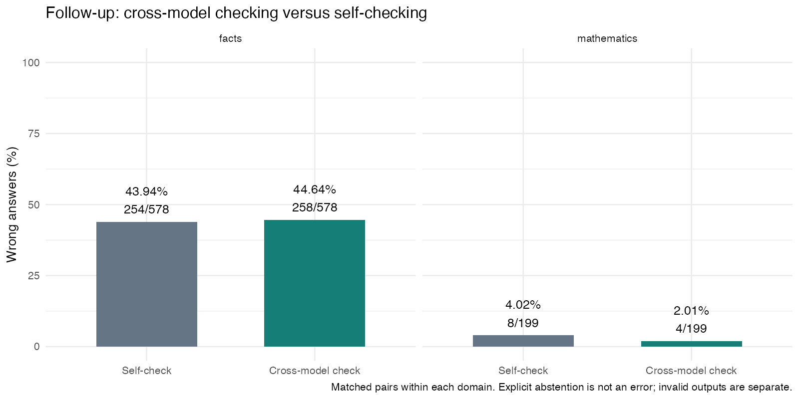
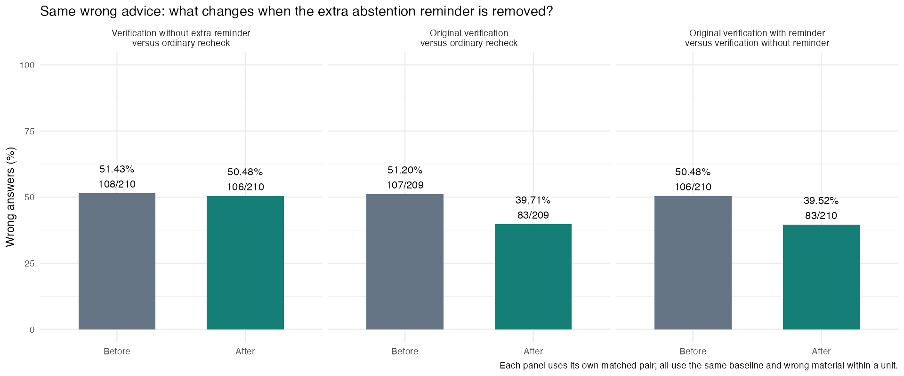

# Cross-checking follow-up: results and limits

Team: **LINYUNIAN and PAN ZHENGYU**. This supplements “Can We Trust AI More After Cross-Checking?”; it does not replace or relabel the earlier frozen experiments.

## What was tested

The user requested additional evidence for natural cross-checking and mathematics, and a verification prompt without an extra abstention reminder. The metric remains wrong/(correct+wrong+explicit abstention), grading the final answer. Correct answers and abstentions are also reported separately. This endpoint does not certify that every assertion in a correct or abstaining response is true; displayed mathematical reasoning is assessed separately.

We fixed 100 previously studied factual date questions and 41 CHAMP questions new to this project. Three different model APIs each answered twice independently. Natural comparisons use N0=direct answer, N1=self-check, N2=ordinary cross-model check, N3=verification with the same natural peer and no added abstention reminder. On a fixed 36-question factual subset, W0/W1/W2 use identical assigned wrong advice with ordinary rechecking / no-extra-reminder verification / the original reminder-containing verification. All branches begin from the same N0; they are not consecutive revisions.

Planned **4,032 outputs** across 846 question-model-repeat units. Recorded **3932 HTTP attempts** across **3920 distinct attempted tasks** (including transport-failure records); **112 planned outputs were not requested**. A task attempt, a complete response and a scorable answer are different concepts.

|domain      |status        | planned_slots|
|:-----------|:-------------|-------------:|
|facts       |incomplete    |             0|
|mathematics |incomplete    |            27|
|facts       |not_requested |            18|
|mathematics |not_requested |            94|
|facts       |ok            |          3030|
|mathematics |ok            |           863|

## 1. Natural cross-model checking versus self-checking

|Domain      |Comparison | Pairs| Questions|Before           |After            |Difference_pp |CI95          |
|:-----------|:----------|-----:|---------:|:----------------|:----------------|:-------------|:-------------|
|facts       |N2-N1      |   578|       100|254/578 (43.94%) |258/578 (44.64%) |+0.69         |[-4.23, 5.52] |
|mathematics |N2-N1      |   199|        39|8/199 (4.02%)    |4/199 (2.01%)    |-2.01         |[-4.74, 0.00] |

**Facts:** The adjusted interval still spans zero: this follow-up does not establish a stable direction of benefit on the selected sample.
**Mathematics:** The adjusted interval still spans zero: this follow-up does not establish a stable direction of benefit on the selected sample.

For the two domain-primary contrasts, the 97.5% marginal intervals are facts [-4.98, 6.17] and mathematics [-5.21, 0.00] percentage points. This is a Bonferroni coverage convention for these two contrasts only; the other comparisons remain exploratory.

The following numbers use the same paired denominator within each domain. A reduction in wrong output is not automatically an increase in correct solutions.

|domain      |metric  |   n| before_n| after_n| difference_pp|
|:-----------|:-------|---:|--------:|-------:|-------------:|
|facts       |error   | 578|      254|     258|     0.6920415|
|facts       |correct | 578|      113|     138|     4.3252595|
|facts       |abstain | 578|      211|     182|    -5.0173010|
|mathematics |error   | 199|        8|       4|    -2.0100503|
|mathematics |correct | 199|      191|     195|     2.0100503|
|mathematics |abstain | 199|        0|       0|     0.0000000|

Receiving-model differences are descriptive; donor identity also changes across repetitions. No universal model ranking follows.

|domain      |provider |   n| difference_pp|     ci_low|   ci_high|
|:-----------|:--------|---:|-------------:|----------:|---------:|
|facts       |deepseek | 195|      9.743590|   1.036136| 18.134715|
|facts       |kimi     | 197|      6.598985|  -1.507538| 14.141414|
|facts       |minimax  | 186|    -15.053763| -22.099448| -8.152174|
|mathematics |deepseek |  69|     -2.898551|  -7.352941|  0.000000|
|mathematics |kimi     |  70|      1.428571|   0.000000|  4.411765|
|mathematics |minimax  |  60|     -5.000000| -11.475410|  0.000000|

For comparison with answering only once, the following is a separate secondary contrast; its pairwise denominator may differ from the primary self-check comparison.

|Domain      |Comparison | Pairs| Questions|Before           |After            |Difference_pp |CI95           |
|:-----------|:----------|-----:|---------:|:----------------|:----------------|:-------------|:--------------|
|facts       |N2-N0      |   584|       100|267/584 (45.72%) |263/584 (45.03%) |-0.68         |[-3.76, 2.26]  |
|mathematics |N2-N0      |   202|        40|11/202 (5.45%)   |4/202 (1.98%)    |-3.47         |[-6.67, -0.97] |

## 2. Does the mathematics evidence go beyond answer-field repair?

These are competition problems from combinatorics, inequalities, number theory, polynomials and sequences, rather than numerical variants of the original four toy families. The prompt requests a concise solution before the final answer, intended to reduce the specific old answer-before-reason artifact. This format change and the new question set mean old and new numerical gains are not directly comparable.

Codex separately read all 16 scorable incorrect mathematical N0 responses (targeted, unmasked AI inspection). All contain a substantive false step or logical inconsistency; 0 are classified as only a wrong final field after fully correct displayed reasoning. See [baseline audit](../baseline_review/README.md) and the exact R checks. This establishes that this set includes real reasoning failures, not that cross-checking necessarily repairs them.

Kimi-k2.6 performed a secondary review with receiver-model, condition and automatic-grade labels hidden. The response wording can still reveal clues about whether peer advice was received, so masking is not guaranteed to conceal the condition completely. The reviewer saw the problem, source solution and vetted correction notes. These are AI judgments about displayed justifications, not proof-checker or human ground truth. Incomplete reasoning is distinct from an explicit false step. The following are raw availability counts with different denominators; they do not estimate a matched improvement.
 

|condition | available| valid| incomplete| incorrect| uncertain| missing| correct_field_wrong_reason|
|:---------|---------:|-----:|----------:|---------:|---------:|-------:|--------------------------:|
|N1        |       224|   194|          9|        21|         0|       0|                          7|
|N2        |       208|   192|          9|         7|         0|       0|                          3| 
Codex inspected all 28 flagged responses and 24 seeded reviewer-valid controls: 8 of these 52 labels were disputed. The original labels are unchanged. In particular, the reviewer sometimes rejects correct algebra and misses false subsidiary claims in correct-answer responses. The following comparison uses the same 206 complete N1/N2 pairs, including complete text whose final field is unscorable. 

|version             |label     | pairs| questions| N1| N2| difference_pp|    ci_low|    ci_high|
|:-------------------|:---------|-----:|---------:|--:|--:|-------------:|---------:|----------:|
|original_kimi       |incorrect |   206|        39| 16|  7|     -4.368932| -8.421053| -0.9478673|
|partial_codex_audit |incorrect |   206|        39| 13|  8|     -2.427185| -5.759414|  0.4717540| 
After the partial audit, the exploratory interval for incorrect displayed reasoning spans zero. The remaining 380 labels have not been independently checked, and these intervals omit annotation uncertainty. Therefore this is not a verified population reasoning-error rate or a strong demonstration of improved logical rigor. See [separate audit and evidence](../review/codex_review_notes.md). Individual original judgments remain under `../review/annotations.csv`.

The primary endpoint is still the final answer. A correct final number with defective reasoning must not be described as a sound solution; the secondary reasoning assessment above addresses that separate property. Topic-cluster sensitivity is retained in `math_topic_sensitivity.csv`, but only five topics make it unstable, and structurally related problems cross some topic labels.

The realized five-topic interval is narrower than the question-cluster interval. Although the protocol anticipated a conservative topic sensitivity, that is not guaranteed: it must not be selected after seeing the data as a stronger primary inference.

The initial three reviewer calls were rejected with HTTP 400 because the implementation requested temperature 0. Kimi K2.6 requires 0.6 in non-thinking mode. Before any reviewer judgments, the configuration was corrected and all 41 jobs were sent for their first actual assessment. The rejected attempts and their conservative cost reservations remain archived; see [configuration amendment](../protocol/review_temperature_amendment.md).

## 3. Verification without strengthening abstention

|Domain |Comparison | Pairs| Questions|Before           |After            |Difference_pp |CI95            |
|:------|:----------|-----:|---------:|:----------------|:----------------|:-------------|:---------------|
|facts  |W1-W0      |   210|        36|108/210 (51.43%) |106/210 (50.48%) |-0.95         |[-6.76, 5.19]   |
|facts  |W2-W1      |   210|        36|106/210 (50.48%) |83/210 (39.52%)  |-10.95        |[-17.93, -4.26] |
|facts  |W2-W0      |   209|        36|107/209 (51.20%) |83/209 (39.71%)  |-11.48        |[-18.96, -4.29] |

W1-W0 measures the verification package after removing the additional abstention sentence. W2-W1 estimates the incremental effect of that sentence within the same verification package. Every group still has the same basic system-level permission to abstain; no group is forced to guess. This is not a full factorial test because there is no reminder-only arm. Do not infer an internal psychological mechanism from these comparisons.

The natural N3-N2 result is a separate secondary comparison under naturally generated peer material:

|Domain      |Comparison | Pairs| Questions|Before           |After            |Difference_pp |CI95          |
|:-----------|:----------|-----:|---------:|:----------------|:----------------|:-------------|:-------------|
|facts       |N3-N2      |   586|       100|264/586 (45.05%) |274/586 (46.76%) |+1.71         |[-0.84, 4.14] |
|mathematics |N3-N2      |   193|        39|2/193 (1.04%)    |1/193 (0.52%)    |-0.52         |[-1.60, 0.00] |

## Missing outputs, sources and interpretation

No substantive wrong or malformed answer was retried to improve the outcome. Only predeclared transport failures received exact retries within the cap. HKU branch concurrency was reduced from four to two after connection timeouts; payloads and scoring were unchanged. Original records and the transport amendment are preserved. Missingness may depend on difficult questions or model behavior; complete-pair analysis does not remove that selection concern.

The primary mathematical comparison retains 199 of 246 planned pairs and 39 of 41 questions. The L-triomino tiling question (P_Combinatorics_20) and the cyclic triple-product question (P_Number-Theory_42) have no complete N1/N2 pair because truncated or invalid initial answers prevented peer branches, or later outputs were incomplete. These include genuine initial errors and must not disappear from the limitations. Thus the apparent mathematical gains are conditional on the usable subset; the full planned-sample bounds below allow either direction.

|domain      |comparison | planned| paired|        low|       high|
|:-----------|:----------|-------:|------:|----------:|----------:|
|facts       |N2-N1      |     600|    578|  -1.500000|  2.8333333|
|facts       |N2-N0      |     600|    584|  -2.333333|  1.0000000|
|facts       |N3-N2      |     600|    586|   0.000000|  3.5000000|
|facts       |W1-W0      |     216|    210|  -3.240741|  0.9259259|
|facts       |W2-W1      |     216|    210| -12.962963| -8.7962963|
|facts       |W2-W0      |     216|    209| -14.351852| -9.7222222|
|mathematics |N2-N1      |     246|    199| -14.227642| 13.8211382|
|mathematics |N2-N0      |     246|    202| -14.634146| 12.1951220|
|mathematics |N3-N2      |     246|    193| -18.292683| 19.5121951|

The last two columns bound the fixed planned-sample error difference under best/worst missing outcomes; they are not sampling confidence intervals. All primary bars use the same pair denominator as their displayed comparison.

### Separate semantic format sensitivity

Codex read all 64 complete but automatically unscorable outputs. 51 receive an unambiguous target-answer interpretation, while 13 remain unresolved. This post-hoc sensitivity reads the complete response for the requested target answer; it does not certify unrelated claims. Nonempty-answer/abstain conflicts remain unresolved, including candidates that match the key. Incomplete or uncollected branches are not reconstructed.

|domain      |comparison |   n| before| after| difference_pp|      ci_low|    ci_high|  ci975_low| ci975_high|
|:-----------|:----------|---:|------:|-----:|-------------:|-----------:|----------:|----------:|----------:|
|facts       |N2-N1      | 590|    265|   264|    -0.1694915|  -5.1928476|  4.7377327|  -5.912162|  5.2588091|
|facts       |N2-N0      | 592|    272|   266|    -1.0135135|  -4.0404040|  1.8678112|  -4.522613|  2.3529412|
|facts       |N3-N2      | 591|    265|   276|     1.8612521|  -0.6734007|  4.3993232|  -1.018676|  4.7538200|
|facts       |W1-W0      | 212|    108|   106|    -0.9433962|  -6.6985646|  5.1643192|  -7.565501|  5.9123608|
|facts       |W2-W1      | 214|    107|    84|   -10.7476636| -18.1395349| -3.7209302| -19.342334| -2.8037383|
|facts       |W2-W0      | 213|    109|    84|   -11.7370892| -19.2488263| -4.6723538| -20.374868| -3.7209302|
|mathematics |N2-N1      | 204|      9|     4|    -2.4509804|  -5.2631579| -0.4672897|  -5.840793|  0.0000000|
|mathematics |N2-N0      | 207|     12|     4|    -3.8647343|  -7.1066591| -1.3824885|  -7.653061| -0.9615385|
|mathematics |N3-N2      | 197|      2|     1|    -0.5076142|  -1.5789474|  0.0000000|  -1.923077|  0.0000000|

All original field grades are unchanged. The sensitivity is exploratory, not a replacement primary endpoint. Individual judgments and evidence are in `../review/codex_format_annotations.csv`.

Additional diagnostics include `availability_diagnostics.csv`, all-four-condition common samples in `common_four_conditions.csv`, receiver/donor pair summaries in `donor_receiver_descriptive.csv`, and mathematical field ordering in `math_field_order.csv`. These are descriptive diagnostics and do not replace the frozen primary contrasts. [Compact mathematical key support](../sources/final_math_gold_support.md) records the additional reasoning check.

Facts reuse an eligible previously studied pool; this is new calls and increased precision, not a held-out factual replication. CHAMP is public and may be present in model training data. We sampled numeric-answer questions, so this is not a complete CHAMP benchmark run. Two incorrect source keys and two premise ambiguities were removed before calling models, with no replacement or outcome-based question selection. Some remaining source proofs had typographical slips; separate vetted notes retain the corrections.

No same-model independent-donor control was added. The experiment assesses this cross-model workflow; it cannot isolate model diversity from receiving an additional independent answer. Tool-assisted search, calculators, multi-round debate, a third arbitrator and real human trust are outside the tested intervention.

Statistical processing uses R and 5,000 resamples of whole question clusters, retaining all model/repeat observations together. Results and all unfavorable directions are retained. More model responses are not equivalent to the same number of independent questions.

## Cost and reproducibility

|provider | attempts| input_tokens| output_tokens| guard_cny|
|:--------|--------:|------------:|-------------:|---------:|
|deepseek |     1316|       364845|        129818|   13.7878|
|kimi     |     1317|       415515|        209602|   18.7904|
|minimax  |     1299|       591345|        163376|   20.8267|

New paid experimental token-envelope estimate: CNY 32.5782. Masked AI review: CNY 5.5807. Prior authorized-work estimate: CNY18.7603. Combined known estimate: CNY 56.9192, against the unchanged CNY100 budget. These are conservative estimates, not invoices. HKU cash pricing is unknown and its tokens are tracked separately.

Reproduce field scoring and statistics offline with `Rscript Followup_Validation/R/analyse.R`, then `Rscript Followup_Validation/R/write_report.R`. Reproducing saved review labels uses `Rscript Followup_Validation/R/review_math.R analyse`; it does not call a model. Live collection and review require separate environment credentials and incur costs.

Sources: [CHAMP paper](https://aclanthology.org/2024.findings-acl.785/) and [official pinned dataset](https://github.com/YilunZhou/champ-dataset/tree/bfb6651efb3d91c266413db44e41d9a83ab789e5). Source license, selection hashes, the before-call protocol and reference-audit exclusions are included in this directory.

