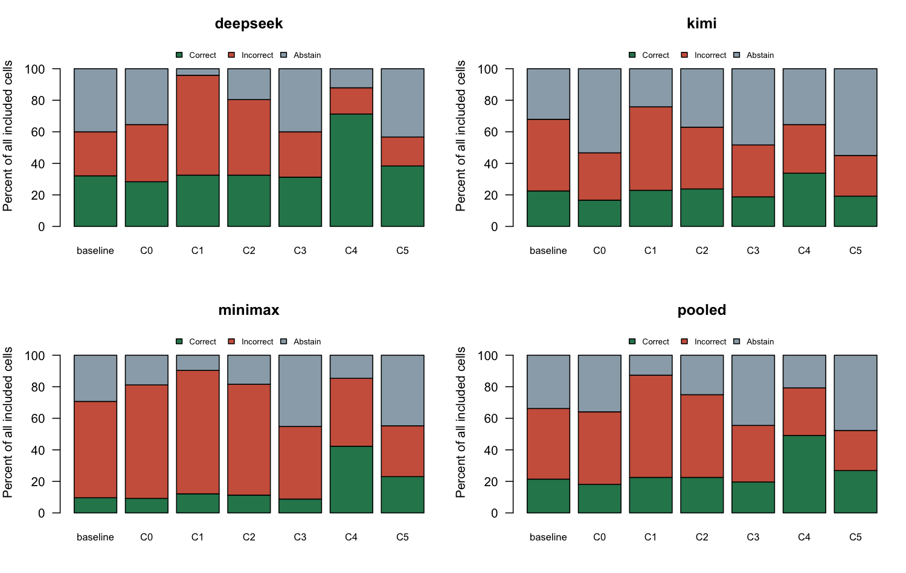
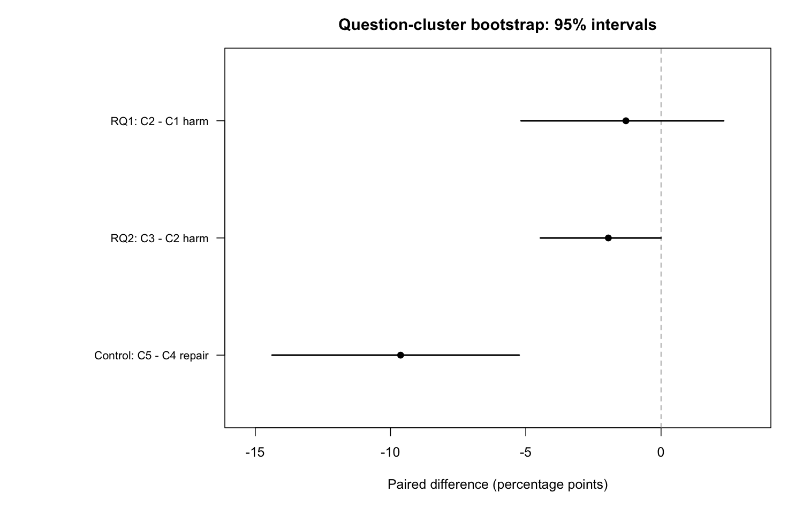

```{r setup, include=FALSE}
knitr::opts_chunk$set(echo=FALSE, warning=FALSE, message=FALSE, fig.width=9, fig.height=5)
tab <- read.csv('main_r/tables.csv')
tab <- tab[tab$provider=='pooled',]
eff <- read.csv('main_r/effects.csv')
eff <- eff[eff$provider=='pooled',]
cells <- read.csv('main_r/cells.csv')
audit <- read.csv('key_review_r/posthoc_effects.csv')
review <- jsonlite::fromJSON('key_review_r/summary.json')
fmt <- function(x) sprintf('%.2f',x)
```

# Problem definition

**研究结论的当前版本：在这组无外部搜索的日期事实题上，结构化核验减少了观察到的正确改错事件，同时降低了采纳正确建议的纠错能力，并增加弃答。没有证据支持“所有double-check都能提高准确率”。** 本文使用冻结评分；关键来源与输出歧义另列事后敏感性分析，独立人工复核尚未完成。

人们常让另一名AI给建议，再要求原模型复核。但建议可能错误；更谨慎的提示也可能使模型拒绝正确建议。这个数据科学问题需要同时衡量防误导能力和接受正确纠正的能力，不能只展示成功案例。

## 两个研究问题

1. **RQ1：** 在另一AI已给出错误日期时，加入解释是否增加接收模型从正确答案改为错误答案的概率？
2. **RQ2：** 对完全相同的建议，结构化核验是否降低正确改错风险，同时保留错误改正确的能力？

难点是题目难度、建议质量、弃答、同题重复的相关性，以及参考答案也可能有歧义。我们使用可追溯的日期事实题和配对分支设计，保留负结果与数据质量问题。本研究没有评估搜索、双agent独立解题后的综合、长篇逻辑严密性或训练方法。

## Existing work

[Chain-of-Verification（Dhuliawala et al., 2024）](https://aclanthology.org/2024.findings-acl.212/)将草稿、核验问题、独立回答和最终修订分开。本研究受核验思路启发，但只测试单次结构化提示，**不是完整CoVe复现**。[Large Language Models Cannot Self-Correct Reasoning Yet（Huang et al., ICLR2024）](https://openreview.net/forum?id=IkmD3fKBPQ)讨论无外部反馈自我纠错的局限；其任务和模型不同，不能直接替代本实验结论。更完整的方法背景与文献见仓库 `docs/accuracy-methods.md` 和 `references/references.bib`。

# Data and methods

## 数据如何得到

从固定SimpleQA Verified快照的1000题机械筛选出207道日期候选，开发24题与其余183题分离。正式材料在来源合格的165题中生成，按固定顺序选前120道材料合格题；未根据正式接收结果挑题。开发最终保留15题、315条响应，和正式分析分开。

正式实验使用DeepSeek V4 Pro、Kimi K2.6、MiniMax M3（HKU接口），每题两次重复；每单元包括初答与六个分支。具体模型ID、请求参数、提示、原始输出与冻结哈希保存在 `runs/`、`data/` 和 `protocol/`。temperature=0.6，thinking关闭，接收模型没有搜索或工具。API产品名不等于永久冻结权重，未来重跑未必逐字一致。

120题×3模型×2重复×7条=5040条返回；两次HTTP502各按相同请求重试一次，因此实际请求5042次。一条正文不可判分，主分析排除其整个七条单元，保留719单元、5033条响应。**5033不是独立样本数。** 跨夜续跑、输出质量修订、开发难度警报未被充分处理均已记录，见 `protocol/deviation-audit.md` 等文件；不声称无执行偏离。

## 干预条件

| 条件 | 初答之后提供的内容 |
|---|---|
| C0 | 中性复核，无另一AI建议 |
| C1 | 研究者指定的错误日期 |
| C2 | 同一错误日期＋另一AI生成的解释 |
| C3 | 与C2完全相同的材料＋结构化核验提示 |
| C4 | 正确日期＋另一AI生成的解释 |
| C5 | 与C4完全相同的材料＋结构化核验提示 |

六个分支分别看见初答，互不看见其他分支的输出。C3不是接在C2之后的下一轮。生成存在随机波动，单个配对案例不能独立证明提示导致了该次变化。错误日期由研究者指定，不能用实验结果估计自然环境中其他AI产生错误建议的概率；正确日期材料也不保证每一句解释背景都准确。

## 判分与统计

全部当前数据处理采用R：读取原始记录、清洗、日期解析、判分、统计、重采样、绘图及导出。历史采集日志保持原样，非标准输出采用冻结的AI审阅记录，待独立复核。日期评分只检查最终答案是否匹配所需年/月/日精度；解释的附带事实不计入原主终点。弃答表示模型明确不提供确定答案，与事实错误及传输故障分开。

主要指标：初答正确单元中的正确改错率；初答错误单元中的错误改正确率。另报全样本正确率、弃答率、回答覆盖率和已回答正确率。预定差为C2−C1、C3−C2、C5−C4，单位均为百分点；负号对前两项表示较少改错，对第三项表示较少纠错。

按整题有放回重采样5000次，保留模型、重复和条件的关联；R种子25011001，报告百分位95%区间。三个对比区间未作多重比较校正；只有少量改错事件，bootstrap边界及非显著结果需谨慎解读。没有预先证明120题足以识别小效应，不能把包含0解释为等效。

# Results

## 总体表现与弃答

```{r overall-table}
knitr::kable(tab[,c('condition','correct','incorrect','abstain','accuracy_pct','abstention_pct','accuracy_among_answered_pct')],
 col.names=c('条件','正确','错误','弃答','全部正确率%','弃答率%','已回答正确率%'), digits=2)
```

```{r overall-figure, fig.cap='原冻结日期评分。结构化组的弃答明显增加；弃答未算正确。'}

```

C2与C3的全部正确率分别为`r fmt(tab$accuracy_pct[tab$condition=='C2'])`%和`r fmt(tab$accuracy_pct[tab$condition=='C3'])`%；弃答率分别为`r fmt(tab$abstention_pct[tab$condition=='C2'])`%和`r fmt(tab$abstention_pct[tab$condition=='C3'])`%。错误输出减少与回答覆盖降低同时出现，不能把变化概括为知识能力提高。

## 回答RQ1与RQ2

```{r effects-table}
e <- eff[,c('contrast','difference_pp','ci_low_pp','ci_high_pp','eligible_cells')]
knitr::kable(e,col.names=c('比较','差值pp','95%下限','95%上限','分母'),digits=2)
```

RQ1：初答正确的154单元，C1改错5次，C2改错3次。没有观察到解释增加改错的证据，但不能据此证明解释不产生影响。

RQ2防御端：C2改错3次、C3为0。零观察事件不等于零风险，且事件极少。RQ2纠错端：初答错误的322单元，C4纠错76次、C5纠错45次。结构化核验在本设置中存在明显取舍。

```{r effect-figure, fig.cap='按题目聚类的95% bootstrap区间；前两项与第三项的有利方向不同。'}

```

## 事后关键案例复核

48个单元在C4正确而C5未正确，其中24错误、24弃答；17个单元在C4未正确而C5正确，其中13原为错误、4原为弃答；28个两组都正确。因此净少31次纠错，不能叙述成只有31个负面案例。

三次C2正确改错分别涉及MAPh更名年份、Alain Stanké授勋年份、Alexandrov Ensemble命名年份；C3的最终日期在三例均匹配冻结参考答案。前两例已由当事机构官方页面支持，第三例目前由博物馆历史资料支持，证据等级不同。它们展示输出差异，不能揭示内部推理因果机制。

本次发现Arch Linux题未区分2012年的安装脚本和2021年的引导式安装器；Wood River成立年在机构来源之间存在1838/1839冲突。另有一条SV1199回答的答案字段正确、abstain=false，但解释说应当弃答。这些问题不被静默修正，全部另存调查文件及事后分析。

```{r posthoc-table}
p <- audit[audit$contrast=='control_C5_minus_C4_repair',c('variant','difference_pp','ci_low_pp','ci_high_pp','eligible_cells')]
knitr::kable(p,col.names=c('事后处理','纠错差pp','95%下限','95%上限','分母'),digits=2)
```

同时排除两道来源争议题后，纠错差为−8.97个百分点，区间[−13.76,−4.53]，方向未变。这是查看结果后的检验，不是预注册排除规则。原七种敏感性分析见 `main_r/report.md`。来源原文、链接和完整范围见 [AI来源复核记录](key_review_r/source-findings.md)。

已制作`r review$selected_questions`题、`r review$focused_responses`条重点响应的独立复核包，隐藏条件、模型和历史分数；正文仍可能泄露条件，所以不称完全盲法。全部人工字段当前为空。本包按结果定向抽取，不能估计全题库的标签错误率。

# Conclusion and future work

目前最稳妥的结论是：**在所测模型、提示和困难日期题中，更强的怀疑能减少部分改错，却也妨碍接受正确纠正；应同时报告错误、正确与弃答。** 本实验不能给所有应用层方法排“最有效”榜单，也不能证明任何提示消除了误导风险。

应用建议是将“没有证据”与“已证明建议错误”区分开，遇到无法核实的日期转向可信来源或人工复查，并同时监测回答覆盖率。这是基于本实验取舍提出的设计建议，**外部检索是否改善结果尚未在本项目测试**。后续首先完成独立人工核查、记录分歧并复算；新增工具或多agent实验需要另立设计，不能混入现有结果。

主要限制包括：非随机筛选的英文日期事实题、较低初答正确率、材料质量筛选、只测三种API与两个重复、少量正确改错事件、没有独立全量人工标签、部分题源歧义及输出解释未完整评分。分析结果不是普遍模型排行榜。

# Course alignment and delivery checklist

课程PDF `About the project.pdf` 第2页原文要求：“One to two data science questions you are going to answer”和项目描述“within 300 words”。该页列出的proposal截止是10月3日23:59；这是所提供课程材料的信息，本次未查询Moodle确认是否更新。本文不是已提交的proposal。

第4页建议展示结构包括“Problem definition”“Results”“Conclusion & future works”“Acknowledgements and References”；本文按这些内容组织。**R Markdown是本项目的实现选择，不冒充课程PDF强制要求。** 第3页列出1或2人项目、1人9分钟报告加1分钟问答、2人18分钟报告加2分钟问答；组员与展示分工待填写。

- 已完成：原始记录、纯R处理、配对分析、图表、可复现入口、事后复核包。
- 待完成：组员独立填写复核、分歧裁决、作者及贡献确认、课程proposal提交状态核对、演讲稿/幻灯片定稿。
- 未执行：Moodle提交、给同学发送材料、新模型调用。

# Acknowledgements, references and reproducibility

数据来自SimpleQA Verified公开题库及本项目的模型调用；完整来源清单与快照见 `data/source_manifest.json`、`data/source_snapshot.csv`。感谢公开数据集与软件维护者。Codex用于实验实现、R迁移、AI来源复核及草稿组织；不把AI工作记作组员已经完成的独立审核。

文献：Dhuliawala et al. (2024), *Chain-of-Verification Reduces Hallucination in Large Language Models*, Findings of ACL, [DOI](https://doi.org/10.18653/v1/2024.findings-acl.212)。Huang et al. (2024), *Large Language Models Cannot Self-Correct Reasoning Yet*, [ICLR论文](https://openreview.net/forum?id=IkmD3fKBPQ)。数据集文献及其他背景文献见仓库 `references/references.bib`，来源争议证据见上方复核记录。

从仓库根目录运行：

```{r commands, eval=FALSE, echo=TRUE}
# Terminal: Rscript Peer_Misleading_Study/reproduce_main.R --out NEW_EMPTY_DIRECTORY
# Terminal: Rscript Peer_Misleading_Study/R/prepare_key_review.R NEW_EMPTY_REVIEW_DIRECTORY
rmarkdown::render('Peer_Misleading_Study/reports/course-report.Rmd')
```

本文渲染读取`main_r/`与`key_review_r/`的R产物，不联网或调用模型。完整从原始日志重算按 `REPRODUCE.md` 执行。数据复现不要求在线模型重答逐字相同。此前R迁移逐条判分与原版本一致、43项产物两次重算一致；本次复核另有哈希与验证记录。

```{r environment, echo=FALSE}
sessionInfo()
```
