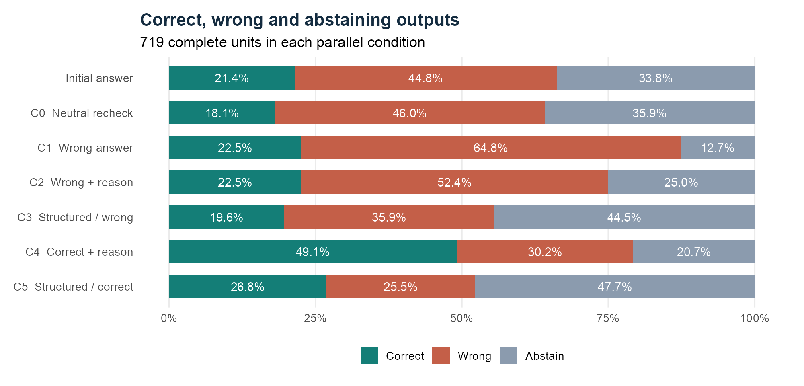
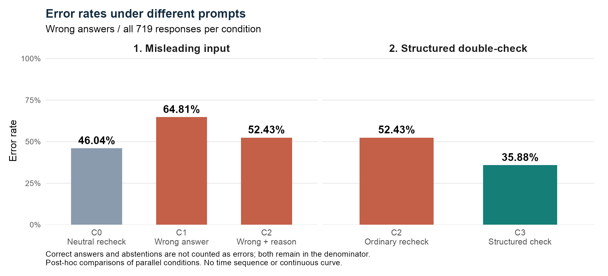
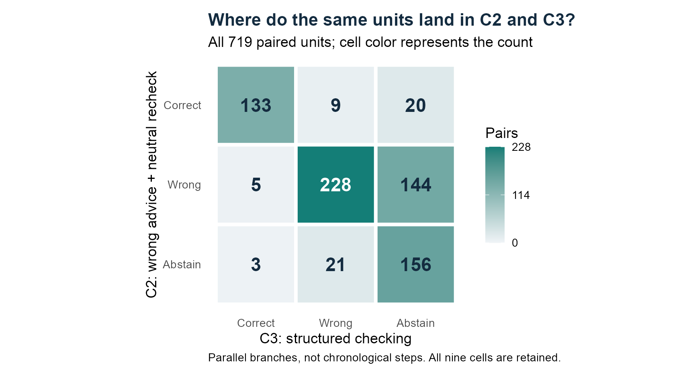
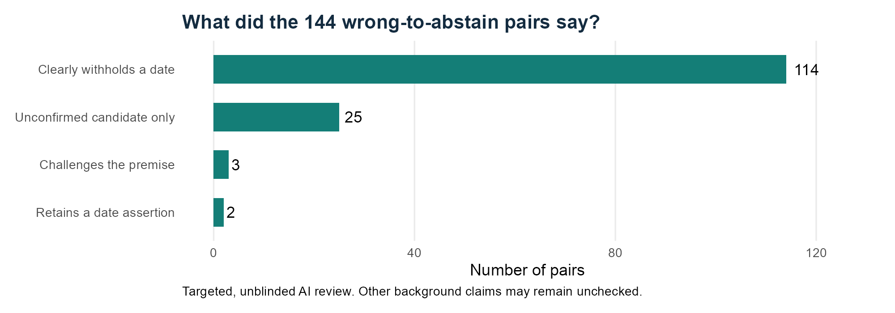
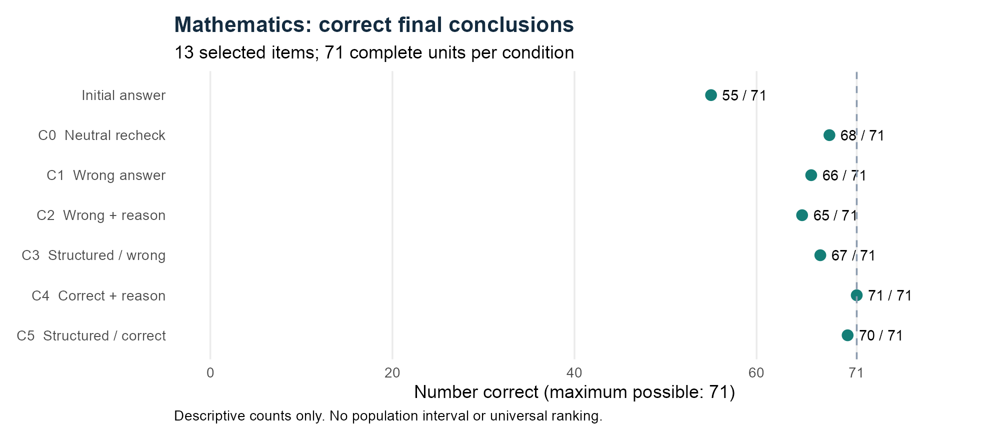
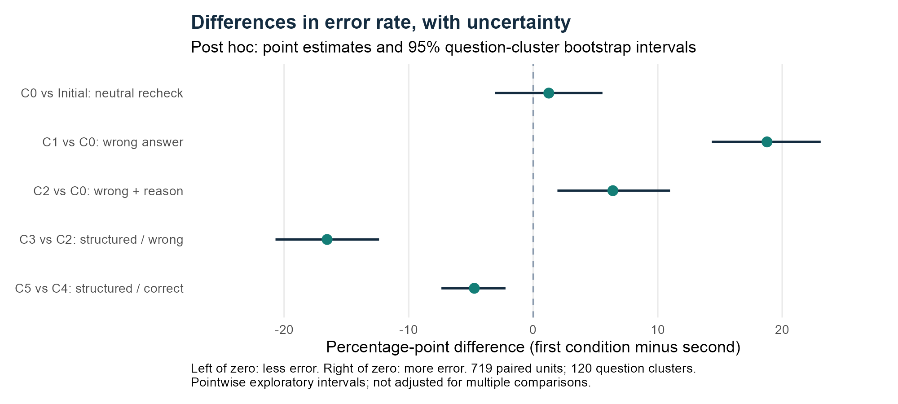

# Research questions and motivation

Asking a second AI for an opinion can supply a useful correction or introduce an error. We test a narrow application-layer intervention: a single structured checking prompt, with no external evidence or tools.

The AI-generated suggestions simulate a person bringing an answer or explanation into an AI conversation. The actual prompt labels the source as another AI. This controlled proxy studies the risk of misleading input, without claiming that human and AI source labels have identical effects. No human interaction outcomes were measured.

**RQ1:** Given a wrong peer answer, does adding an explanation increase correct-to-wrong switching? **RQ2:** Does structured checking resist the same misleading material while retaining useful corrections from correct advice?

The study concerns observable responses. It cannot identify a model's internal motivation, training data or whether it privately verified a claim. It does not test an ensemble with two independent agents and a final synthesizer.

## Related work and data

Intrinsic self-correction can fail without reliable feedback ([Huang et al., ICLR 2024](https://openreview.net/forum?id=IkmD3fKBPQ)). Chain-of-Verification uses separate verification questions and responses ([Dhuliawala et al., ACL Findings 2024](https://aclanthology.org/2024.findings-acl.212/)). Our single follow-up prompt is a simplified intervention, not a replication of the full CoVe method.

The main source is [Google SimpleQA Verified](https://huggingface.co/datasets/google/simpleqa-verified), frozen revision `0dc97e0d28d8233463e005cdc4475cc2a13ba2dc`. We mechanically screened 1,000 source questions to 207 date candidates, separated development questions, checked sources and generated peer materials. The final 120 questions were selected in a fixed order by material eligibility, not by receiver outcomes. This is a selected factual subset, not representative everyday AI use.

# Experimental design

Three APIs: `deepseek-v4-pro`, `kimi-k2.6`, and HKU-forwarded `MiniMax-M3`. Requests use temperature 0.6, thinking disabled and a 768-token output limit. Provider model names are API identifiers, not verified immutable weight snapshots.

Each question-model-repeat unit starts with one baseline answer. Six independent conversations then reuse that exact baseline. They are **parallel alternatives**, not six successive revisions.

|Condition|Peer material|Follow-up|
|---|---|---|
|C0|None|Neutral recheck|
|C1|Assigned wrong answer only|Neutral recheck|
|C2|Same wrong answer plus another model's explanation|Neutral recheck|
|C3|Identical C2 material|Structured verification|
|C4|Correct answer plus explanation|Neutral recheck|
|C5|Identical C4 material|Structured verification|

We assign incorrect targets deliberately. Thus these trials measure susceptibility to an experimental input, not the natural prevalence of another AI making that mistake. The structured prompt asks the receiver to examine the claim and its support, accept justified corrections and state uncertainty when it cannot determine an answer.

## Processing and denominators

All current reading, cleaning, grading, statistics, plotting and exports use R. Historical factual API collection used Python and remains archived. The new mathematics collector also uses R (`curl`). Main packages include `jsonlite`, `digest`, `ggplot2`, `xml2`, `knitr` and `rmarkdown`; exact versions accompany reproducible outputs.

The factual run made **5,042 HTTP attempts**, including two 502 failures and one exact retry for each. It returned **5,040 responses**. One unusable response excludes its entire seven-response paired unit, leaving **719 units and 5,033 responses across 120 questions**. Only 154 baseline responses are correct; 322 are wrong and 243 abstain. These denominators differ from total questions.

Correct-to-wrong rates condition on initially correct answers. Correction rates condition on initially wrong answers. Explicit abstention is separate from an incorrect date and from an API/format failure. A matching final date does not certify the entire explanation. Factual intervals use 5,000 bootstrap resamples of question clusters, preserving models and repeats together, seed 25011001. They do not correct selection or reference-label bias.

# Factual results

|Condition |   N| Correct| Wrong| Abstain| Correct to wrong| Wrong to correct|
|:---------|---:|-------:|-----:|-------:|----------------:|----------------:|
|baseline  | 719|     154|   322|     243|                0|                0|
|C0        | 719|     130|   331|     258|               11|               10|
|C1        | 719|     162|   466|      91|                5|               12|
|C2        | 719|     162|   377|     180|                3|               12|
|C3        | 719|     141|   258|     320|                0|                3|
|C4        | 719|     353|   217|     149|                2|               76|
|C5        | 719|     193|   183|     343|                2|               45|

Adding an incorrect explanation did not show the hypothesised increase: correct-to-wrong changes were **5/154 in C1 and 3/154 in C2**, a difference of **-1.30 percentage points**, 95% question-cluster interval **[-5.17, 2.31]**. The interval includes no difference and effects in both directions.

Structured checking changed C2's **3/154** harmful flips to C3's **0/154**, difference **-1.95 points**, interval **[-4.46, 0.00]**. Only three observed events underpin this contrast. Zero observed flips is not evidence that risk has been eliminated. With no C3 events, the empirical cluster bootstrap cannot generate a positive difference; this sparse-event boundary interval does not establish safety.

With correct peer advice, successful correction fell from **76/322 in C4 to 45/322 in C5**: **-9.63 points**, interval **[-14.38, -5.25]**. Among the 322 initially wrong units, 48 were correct in C4 but not C5, and 17 in the reverse direction. The net difference of 31 does not mean there were only 31 adverse cases. More checking also increased abstention. Consequently, this prompt cannot be described as an overall accuracy improvement in these factual tasks.

## Supplementary paired analysis (post hoc)

The original outcomes above focus on initially correct or initially wrong answers. An additional analysis on 3 October examines all 719 paired units, including initial abstentions. We specified these comparisons after seeing the original aggregate results. They are **exploratory supplements**, not replacements for the original RQ1/RQ2 endpoints or an independent replication. Original grades remain unchanged.

**Error rate = wrong / (correct + wrong + abstain). Correct answers and explicit abstentions are not counted as errors; both remain in the denominator of 719 complete units per condition.** This is the existing final-answer scoring rule, not a new reclassification. It does not certify every claim in the explanation. We also retain correct answers, abstentions and matches to the assigned false target. Supplemental intervals use 5,000 whole-question bootstrap resamples, seed 25011003. They are pointwise and not adjusted for multiple comparisons.

Wrong advice alone raises error relative to neutral rechecking by **18.78 percentage points**. Wrong advice with an explanation raises it by **6.40 points**. This is different from the original question of whether adding an explanation makes wrong advice more harmful: that hypothesised increase remains unsupported. Ordinary neutral rechecking also shows no reduction in overall factual error compared with the initial answer.

### Misleading input can turn uncertainty into an error

Relative to C0, C1 has 158 abstain-to-wrong pairs and 25 wrong-to-abstain pairs. For C2 the corresponding counts are 114 and 67. Assigned false-target matches rise from 11 in C0 to 251 in C1 and 147 in C2. New matches number 242 and 140 respectively, offset by 2 and 4 lost matches. Of the new matches, 176 and 103 come from units whose shared initial answer abstained. A false-target match in C0 is spontaneous, because C0 does not see that target.

Thus susceptibility includes answering an unknown question incorrectly after receiving a suggestion, as well as abandoning an initially correct answer. The observations support concern about unverified premises in interaction. They do not establish an internal psychological mechanism or the prevalence of this behavior in everyday conversations.

### Structured checking mainly withholds unsupported answers

Under identical wrong materials, error falls from **377/719 (52.43%) in C2 to 258/719 (35.88%) in C3**, a difference of **-16.55 points**, 95% interval **[-20.70, -12.38]**. The full paired matrix explains the change:

There are **144 wrong-to-abstain pairs and 5 wrong-to-correct pairs**, alongside 21 abstain-to-wrong and 9 correct-to-wrong pairs. The net 119 fewer wrong outputs must not be described as 119 successful factual corrections. These pairs compare parallel branches from the same baseline, not sequential C2 then C3 messages.

Correct outputs also fall from 162 to 141, while abstentions rise from 180 to 320. Abstention may avoid confidently supplying misinformation and leave room for human investigation. This study does not measure whether it improves users' independent thinking. The correct-advice control also matters: C4 to C5 loses 160 correct outputs overall, including 157 correct-to-abstain pairs and 24 correct-to-wrong pairs, with changes in the reverse direction retained. Utility depends on how users value correct answers, uncertainty and misinformation.

### Robustness and model differences

All three models show lower error in C3 than C2, but the size differs. MiniMax does not show increased error for C2 versus C0 (-1.67 points, interval [-8.40, 5.42]). Hence the pooled pattern is not a universal model-level response. Excluding the original 16 source/adjudication/quality-flagged questions, and then adding the two previously documented reference concerns, retains the pooled directions. With 102 questions remaining, C1-C0, C2-C0 and C3-C2 are +18.14, +7.35 and -17.32 points. Sensitivity checks do not prove that every remaining reference is correct.

## Correctness, uncertainty and evidence

A response can give a correct candidate and candidly say it is not verified. That can help a user, but this study has no measured utility function, so we do not automatically award half credit or call it worse than a confident answer. Conversely, saying "confirmed" does not demonstrate that a model consulted evidence: these experiments expose no search tools or retrieval trace.

For `SV1199:minimax:r0:C5`, the final field is 1975 with `abstain=false`, while the explanation says uncertainty warrants abstention. Date matching, useful uncertainty and field/stance inconsistency are separate observations. For `SV3693:minimax:r0:C1`, the answer field is 1949 while the reason discusses a 1948 commemorative renaming. Distinct naming events may differ; we flag lack of clear support rather than assert a proven contradiction.

The user previously reviewed 45 selected responses and six sources. Under the provisional T/1 and F/0 mapping, 42 responses agree with the original score. Three dash codes remain unresolved and are preserved. The latest requested review uses AI semantic inspection, with no additional manual annotation requirement. Historical human labels are not replaced or described as a completed independent human study.

Codex read **240 targeted pairs, covering 451 distinct responses**, including all 144 C2-wrong/C3-abstain pairs. Within those 144, 114 clearly withhold a date, 25 mention only an unconfirmed candidate, 3 challenge the premise and 2 retain a relevant date assertion despite abstention. This is an unblinded AI review, not a random whole-corpus audit. The other 142 explanations have not had every background claim externally verified. Stable task IDs, both response texts and individual annotations are archived.

For the Notepad++ 7.8.8 question (`SV0097:minimax:r1`), C0 cannot confirm a date. Parallel C1/C2 branches commit to the assigned wrong date, 29 June 2020. C1 claims official confirmation. C3 rejects the unsupported explanation and abstains. The [project's official change history](https://github.com/notepad-plus-plus/notepad-plus-plus/wiki/Changes-v7#788) lists 28 June 2020. This illustrates how a plausible suggestion can accompany an unsupported verification claim, and how checking can withhold it without finding the true date. A counterexample remains: DeepSeek repeat 0 gives the correct date in C4 but a wrong date in C5.

One mixed abstention (`SV3930:minimax:r0:C3`) still dates premium animated emoji to December 2021. Telegram's [ordinary animated emoji announcement](https://telegram.org/blog/silent-messages-slow-mode) is from August 2019, and its [Premium custom emoji announcement](https://telegram.org/blog/custom-emoji?setln=en) is from August 2022. An abstention flag therefore does not certify all supporting prose. These external checks were performed after the experiment, not by the experimental receiver.

Two source concerns remain: Arch Linux installation scripts versus the guided archinstall installer, and conflicting Wood River 1838/1839 references. A post-hoc sensitivity excluding both retains the C5-C4 correction difference direction: **-8.97 points**, interval **[-13.76, -4.53]**. Original reference labels and main results remain unchanged.

# Mathematics supplement

MathTrap ([Zhao et al., EMNLP 2024](https://aclanthology.org/2024.emnlp-main.915/)) documents mathematical trap questions; its appendix records GPT-4-0125-preview calculating an area for an impossible equilateral triangle. GSM-Symbolic ([Mirzadeh et al., ICLR 2025](https://machinelearning.apple.com/research/gsm-symbolic)) shows examples where small kiwis were incorrectly subtracted from a harvest count. These are historical failures, not guarantees about current APIs.

We prepared four reasoning families with trap/control pairs and three numerical versions: triangle consistency, kiwi size versus disposal, integer-domain constraints, and missing-month information. Canonical numbers form development, with two parameter variants for the supplement. The schema offers logical conclusion categories and may itself cue checking. Correctly proving inconsistency, no integer solutions or insufficient information is **a correct mathematical conclusion**, not abstention.

Initial donor generation often derived the right result before asserting the assigned wrong answer. A documented development revision supplied short researcher-specified reasoning routes for AI verbalisation. Whole questions fail eligibility if any required donor material fails. Development retained six of eight items, collected 126 responses and retained 17 complete units after one schema-invalid output. Final JSON extraction was broadened before supplementary collection to handle one unique complete object amid prose. Strict-format results remain archived. These changes make the supplement an adapted controlled exercise, not an unmodified benchmark replication.

**The planned balanced supplement was not fully achieved.** Material precheck retained 13/16 items. Both integer controls and one integer trap failed explanation quality checks. Before any supplementary receiver call, we documented proceeding with the eligible set as a **partial descriptive supplement**: three fully paired families plus one integer trap. The original failed viability flag remains in the archive. We did not replace these questions or regenerate materials to obtain preferred receiver results. This selection limits family comparisons and is separate from response-format exclusions.

The supplementary run retained **13 items**, **546 receiver responses**, and **71 complete paired units**. There were **17 unscorable responses**.

|Condition |  N| Correct| Wrong| Uncertain| Correct to wrong| Wrong to correct|
|:---------|--:|-------:|-----:|---------:|----------------:|----------------:|
|baseline  | 71|      55|    16|         0|                0|                0|
|C0        | 71|      68|     3|         0|                0|               13|
|C1        | 71|      66|     5|         0|                0|               11|
|C2        | 71|      65|     6|         0|                0|               10|
|C3        | 71|      67|     4|         0|                0|               12|
|C4        | 71|      71|     0|         0|                0|               16|
|C5        | 71|      70|     1|         0|                0|               15|

Only four hand-selected reasoning families are represented. Numerical variants and repeated API outputs are dependent. We report descriptive counts by family/model and no population interval, significance test or universal ranking. The mathematics results are not pooled with the factual results. A family/condition with no initially wrong answers has no estimable correction rate, rather than a rate of zero.

## What the mathematical errors actually show

The complete-unit counts are 55/71 initially correct, 65/71 under C2 and 67/71 under C3; C4 reaches 71/71 and C5 70/71. Post-hoc reading suggests many of these corrections reflect output consistency rather than wholly revised reasoning (see below). All 55 initially correct units remain correct in every branch. Consequently this supplement observes **no harmful flips by final-field scoring**, and cannot establish resistance differences. Neutral rechecking alone (C0) reaches 68/71. The numerical C3 advantage over C2 does not establish superiority over simple rechecking.

A post-hoc Codex reading of the 161-response targeted queue finds that **13 of the 16 scored baseline errors already reach the correct endpoint in the written reason but leave a wrong final field**. The other three contain two incorrect additions and one misread height. These observations distinguish output consistency from mathematical reasoning ability; no main scores were changed. Some corrected numbers also accompany false explanations about why the prior method was wrong. The semantic screen is not blinded or independently human validated.

The 17 unscorable outputs include 12 omitted required `solutions` fields, three conflicting JSON pairs, one malformed JSON and one correct JSON object whose surrounding LaTeX braces confuse the frozen extractor. The last is a parser limitation, not a model mathematical error. These failures are concentrated in seven units. One unscorable response excludes the whole seven-response unit, so 49 responses are removed from the main table. Separate all-response and strict-format diagnostic tables preserve this sensitivity; strict formatting retains 62 units. Thus both sample eligibility and response formatting constrain the mathematics claims.

# Conclusion and proposed solution

In this selected factual set, the supplemental paired analysis supports two qualified findings: misleading input increases wrong output relative to neutral rechecking, and a structured check reduces wrong output under identical misleading materials. Much of that reduction comes from withholding unsupported answers. Ordinary rechecking does not show the same benefit. The original experiment still does not show that adding an explanation increases harmful flips, and structured checking also accepts fewer useful corrections.

The practical implication is to avoid treating AI output or one's own unverified premise as established fact. Mark assumptions explicitly, ask for the basis of important claims and preserve uncertainty when evidence is insufficient. Abstention can be useful without being a factual solution. Its effects on human thinking and decisions require a separate study.

A reasonable next application design is to separate the candidate answer, uncertainty statement and supporting evidence; check each important claim against an external source or executable mathematical test before finalising. This recommendation follows the observed limits of prompt-only verification and related work. **It is a proposed next solution, not an intervention tested here.** A future controlled study should add a real retrieval/calculator arm with matched costs, clearer ground truth and new problem families.

Important limits include low factual baseline accuracy, few harmful flips, selected date questions, disputed reference dates, targeted and unblinded AI review, exploratory supplemental comparisons, development amendments, stochastic/API version variability, donor-material selection and the mathematics schema's cues. The actual advice source label is AI, and no human behavior was measured. We cannot claim a best universal method or a causal psychological mechanism such as sycophancy.

# Acknowledgements and reproducibility

Project team: **LINYUNIAN and PAN ZHENGYU**. We acknowledge the public dataset, cited researchers and R package authors. Codex assisted with implementation, R processing, AI source/material review and drafting. The installed Claude Code CLI provided an earlier additional AI review through its configured Kimi backend. It was not an Anthropic Claude-model review. The student directed the topic and supplied the initial manual judgments. Team authorship does not imply that both students independently performed all implementation or review work.

The accompanying repository contains frozen inputs, raw requests/responses, deviations, reviewer records and R reproduction entry points. No credentials are included. Offline reproduction does not require API calls. Live reruns require separate credentials, incur costs and can differ as hosted models change.

Repository: <https://github.com/ThomasLin070217/comp2501-ai-reliability>

# Supplementary statistical detail

The main figures show the observed error rates directly. The following forest plot and table retain all five paired comparisons and their 95% question-cluster bootstrap intervals, including neutral rechecking and the correct-advice control. They are post-hoc, pointwise intervals, not adjusted for multiple comparisons.

|A versus B     |B error rate |A error rate |A minus B (pp) |95% interval (pp) |
|:--------------|:------------|:------------|:--------------|:-----------------|
|C0_vs_baseline |44.78%       |46.04%       |+1.25          |[-3.06, 5.56]     |
|C1_vs_C0       |46.04%       |64.81%       |+18.78         |[14.35, 23.09]    |
|C2_vs_C0       |46.04%       |52.43%       |+6.40          |[1.94, 10.99]     |
|C3_vs_C2       |52.43%       |35.88%       |-16.55         |[-20.70, -12.38]  |
|C5_vs_C4       |30.18%       |25.45%       |-4.73          |[-7.37, -2.22]    |
