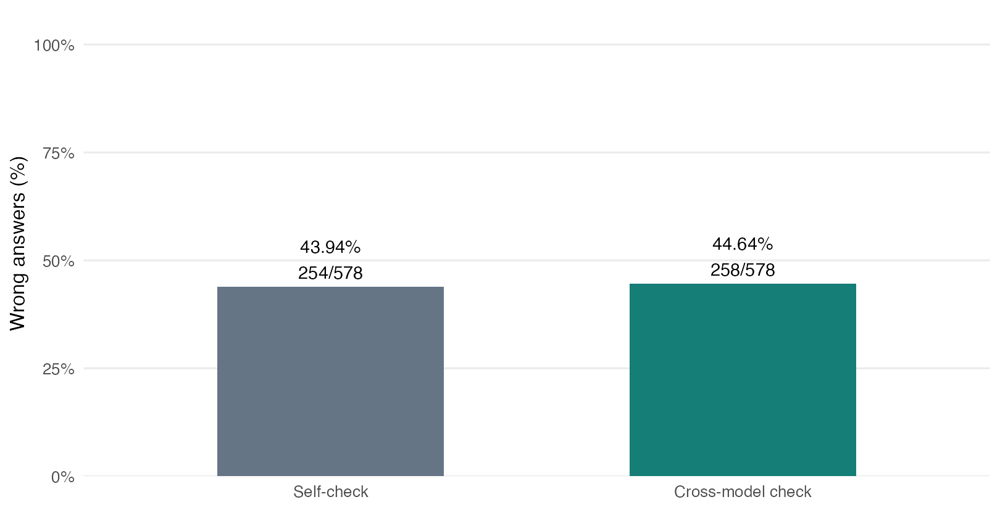
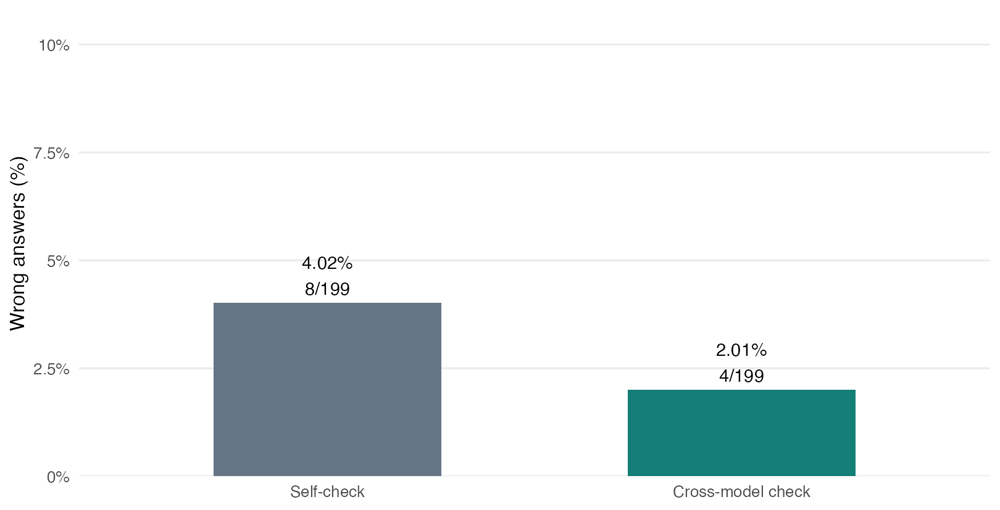
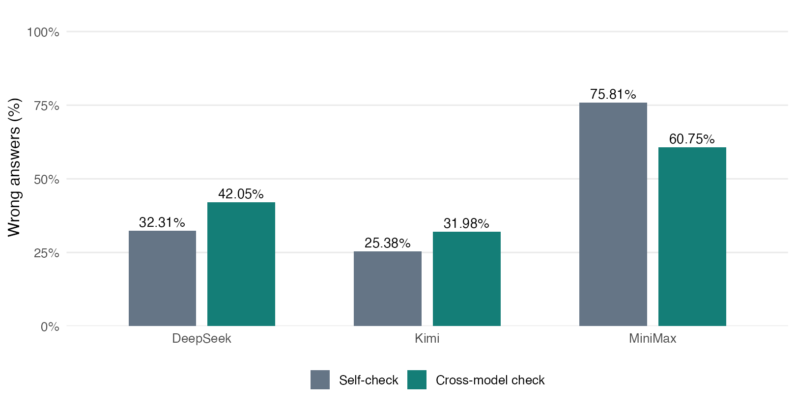
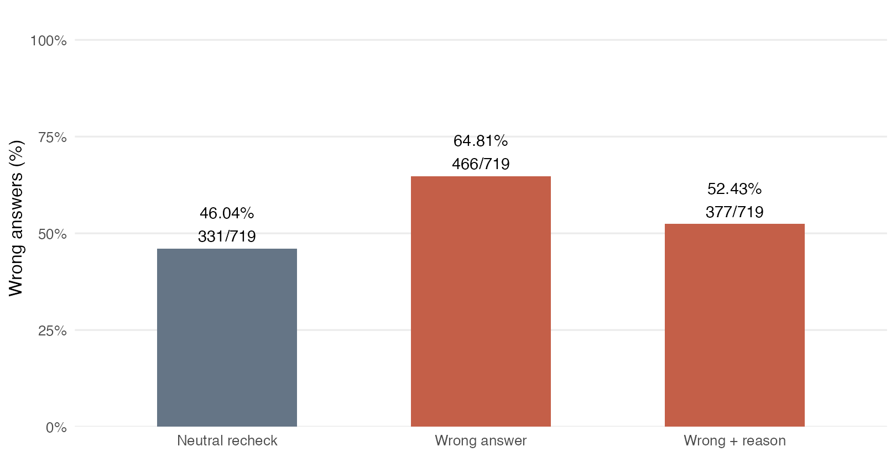
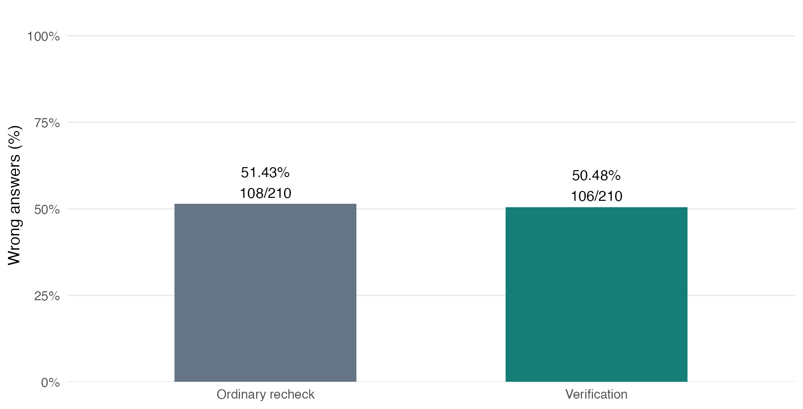
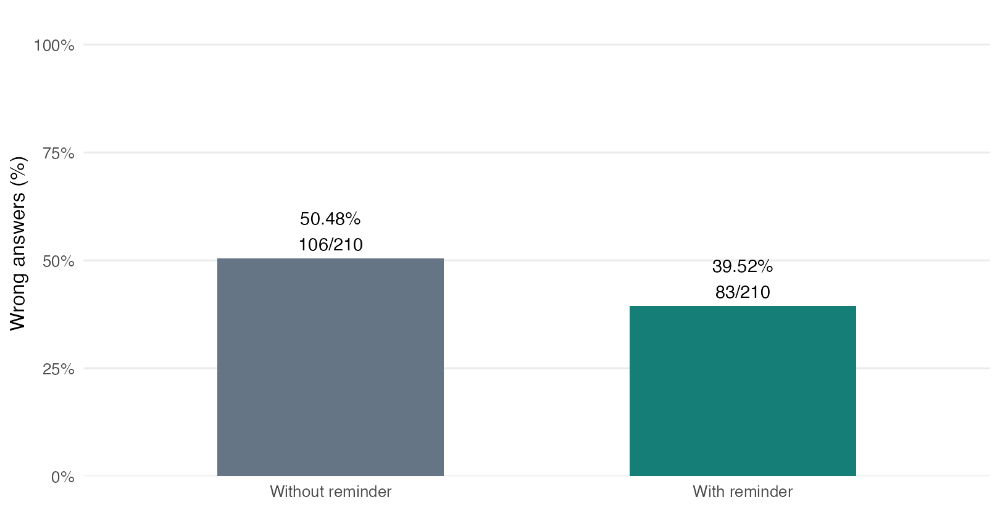
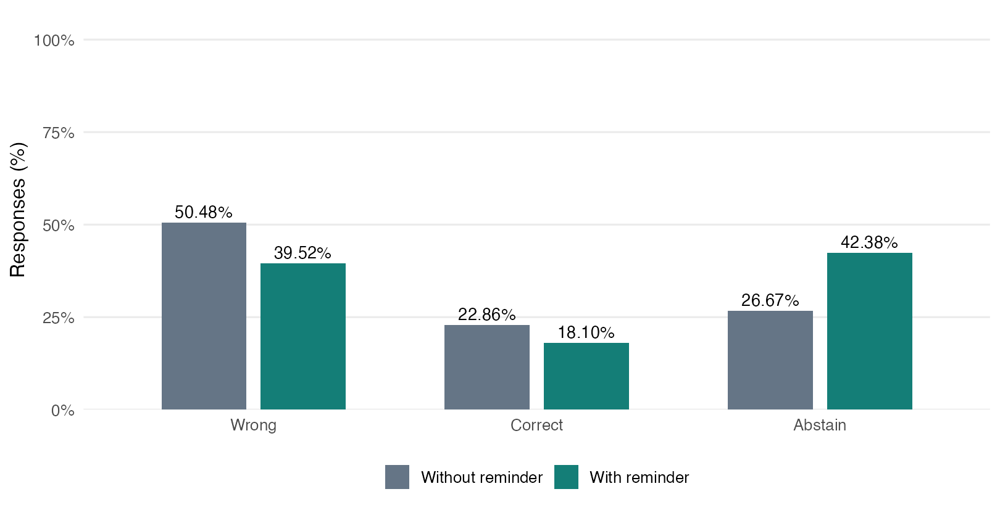

# Executive summary

Cross-checking can repair an answer, but our experiments do not establish that using a different model reliably improves on self-checking. In the expanded natural-checking study, factual error changes from **43.94% to 44.64%** and mathematical error from **4.02% to 2.01%**. Both adjusted primary intervals include zero. The mathematical result also excludes some difficult, incomplete pairs.

A separate controlled factual experiment shows that supplied wrong answers can increase error. Relative to neutral rechecking, wrong-answer-only advice increases error by **18.78 percentage points**, and wrong answers with explanations by **6.40 points**. These are exploratory comparisons of assigned misleading materials, not estimates of how often another model naturally gives bad advice.

The new prompt ablation clarifies an earlier finding. Verification without an extra abstention reminder shows no clear error reduction. Adding the reminder reduces error by **10.95 points** under the same wrong advice, while correct answers decrease and abstentions increase. This can be useful caution without better factual knowledge. We report all three outcomes and do not treat abstention as a correct answer.

Our practical conclusion is conditional: independent answers can help expose disagreement, but agreement and confident explanations do not guarantee truth. Important claims still need evidence beyond another unsupported answer. External retrieval, calculators and human decision benefits remain proposed extensions, not tested outcomes.

# 1. Motivation and research questions

According to LINYUNIAN's recollection, Professor LUO RUIBANG asked who would completely trust an AI answer. LINYUNIAN raised a hand because using multiple agents to cross-check answers seemed to improve reliability. This is a paraphrase of a classroom recollection, not a recorded quotation of the professor.

That experience led to two questions:

1. Does a different model's independently generated answer reduce error beyond an ordinary self-check, and does the result differ between factual and mathematical tasks?
2. Can wrong advice mislead the receiver, and does a verification prompt help when we separate its checking instructions from an extra reminder to abstain?

The title uses “trust” as the motivating question. The measured outcomes concern model answers, not human trust, thinking or decision quality. AI-generated advice models the presence of a suggested answer and rationale in an interaction. Prompts identify its source as another AI. We do not directly test human-authored prompts, source-label effects or a psychological mechanism such as sycophancy.

## Related work

[Huang et al. (ICLR 2024)](https://openreview.net/forum?id=IkmD3fKBPQ) examine limitations of intrinsic self-correction without reliable feedback. [Dhuliawala et al. (ACL Findings 2024)](https://aclanthology.org/2024.findings-acl.212/) use separate verification questions in Chain-of-Verification. Our single revision prompt is a simpler intervention, not a replication of that full method. [CHAMP (ACL Findings 2024)](https://aclanthology.org/2024.findings-acl.785/) supplies competition mathematics and reference solutions for the latest supplement. Earlier exploratory tasks drew on mathematical traps and irrelevant-information failures documented by [MathTrap](https://aclanthology.org/2024.emnlp-main.915/) and [GSM-Symbolic](https://machinelearning.apple.com/research/gsm-symbolic). Historical model failures motivate the tests but do not establish error rates of current APIs.

# 2. Study design and data

## Separate experiments answer separate questions

|Study|Sample and purpose|Role in this report|
|---|---|---|
|Original controlled advice|120 selected date questions, 719 complete model-repeat units|Effect of assigned misleading or correct advice|
|Expanded natural checking|100 previously studied date questions and 41 new-to-project CHAMP questions, three models, two repeats|Latest primary evidence on cross-model versus self-checking|
|New prompt ablation|A fixed 36-question subset of those facts|Separate verification from the extra abstention reminder|
|Earlier natural and mathematics runs|49-question natural run and 13-item controlled math supplement|Historical context and design lessons, summarised in Appendix A|

We do not pool responses across these studies. The expanded study uses fresh calls on the eligible factual pool; it is not a held-out factual replication. “New” mathematics means new to this project, not necessarily unseen during model training. The expanded protocol was frozen before its own calls, after we had reviewed the earlier studies.

The factual source is [Google SimpleQA Verified](https://huggingface.co/datasets/google/simpleqa-verified), revision `0dc97e0d28d8233463e005cdc4475cc2a13ba2dc`. The original pipeline screened 1,000 items to 207 date candidates, separated development items and selected 120 by material eligibility. The follow-up removes 18 previously excluded items and two premise/naming concerns, leaving 100. This is a difficult selected date subset, not a sample of everyday AI questions.

For mathematics, a fixed-seed sample selected 45 numeric-answer text problems from five CHAMP topics: combinatorics, inequalities, number theory, polynomials and sequences. Before model calls, we excluded two incorrect source answer keys and two zero-side triangle ambiguities without replacement, leaving 41. We retain the [pinned official dataset](https://github.com/YilunZhou/champ-dataset/tree/bfb6651efb3d91c266413db44e41d9a83ab789e5), MIT license, original solutions and separate correction notes. Public benchmark exposure and shared problem structure limit generalisation.

## Natural checking uses genuinely different models

The receiving APIs are `deepseek-v4-pro`, `kimi-k2.6` and HKU `MiniMax-M3`. Each independently answers each question twice. Within a repeat, a receiver sees one other model's corresponding independent answer. The second repeat reverses donor direction, so every receiver uses both other model types. Receiver and donor are always different.

|Condition|Information and action|
|---|---|
|N0: direct answer|Answer the question independently|
|N1: self-check|Reconsider the question and the receiver's own N0|
|N2: cross-model check|Reconsider the same N0 with another model's independent answer and explanation|
|N3: verification|Use the identical natural advice as N2, with explicit verification instructions and no extra abstention reminder|

All revision branches start separately from N0. N2 does not receive N1, and N3 does not receive N2. There is one final receiving-model revision, no third arbitrator and no multi-round debate. No tested model has web search, a calculator or external retrieval. Natural donor answers remain unchanged even when wrong or uncertain.

N2 minus N1 is the primary comparison in each domain. It controls for an additional receiving-model attempt, but peer generation adds a separate call and more context. Without a same-model independent-donor arm, the design cannot isolate the benefit of model diversity from the benefit of an additional independently generated answer. It does not establish equal-cost superiority.

Requests use temperature 0.6 with thinking disabled, up to 768 output tokens for facts and 1,536 for mathematics. Mathematical prompts request reasoning before the final answer to reduce the earlier answer-before-reason inconsistency. Hosted model names and settings describe these runs, not permanently fixed model weights.

## Controlled advice and the reminder ablation

The original conditions are C0 neutral recheck, C1 assigned wrong answer, C2 assigned wrong answer with explanation, C3 verification of identical C2 material, C4 correct target with explanation and C5 verification of identical C4 material. Different models verbalised researcher-assigned targets. Eligibility checks do not guarantee every background assertion in an explanation is true.

The new factual ablation holds the initial answer and assigned wrong material fixed:

|Condition|Follow-up instruction|
|---|---|
|W0|Ordinary recheck|
|W1|Verification, without the extra abstention sentence|
|W2|The same verification prompt, with the extra abstention sentence|

W1 versus W0 tests the remaining verification package. W2 versus W1 tests the incremental reminder within that package. Every group retains the same basic system permission to abstain. There is no reminder-only arm, so this is not a full factorial experiment. The two-step comparison cannot identify the model's internal reasoning mechanism.

## Outcomes and statistics

**Error rate = wrong final answers / (correct final answers + wrong final answers + explicit abstentions).** Correct and abstaining responses both remain in the denominator, but only the former count as correct. An explicit valid mathematical conclusion such as “no integer solution” is correct when justified by the task, not an abstention. A correct field does not certify every sentence of the explanation. Mathematical reasoning has a separate secondary review.

Missing calls, truncated outputs, invalid formats and conflicting answer/abstention fields remain unscorable. We never convert them into deliberate abstention. Each comparison uses its own complete pair, and every plotted contrast uses exactly the same denominator as its accompanying estimate.

All current data processing, inference and figures use R. The latest study uses 5,000 bootstrap resamples of whole question clusters, retaining model and repeat observations together (seed 25011006). For its two domain-primary error contrasts, we report 97.5% marginal intervals as a Bonferroni convention. Other intervals are exploratory 95% intervals. The number of model outputs is not the number of independent questions. Intervals describe this selected collection and do not account for all reference or annotation uncertainty.

## Collection completeness

The expanded run planned 4,032 outputs in 846 question-model-repeat units. It records 3,932 HTTP attempts on 3,920 distinct tasks, including 12 exact retries after transport failures. Of these tasks, 3,893 returned complete text and 27 were incomplete. Another 112 branches were not requested because required inputs were unavailable or invalid. Among complete responses, 64 were unscorable by the frozen parser, leaving **3,829 scorable answers: 1,443 correct, 1,402 wrong and 984 abstentions**.

We did not retry substantive errors or add questions after seeing outcomes. A documented HKU transport amendment reduced branch concurrency from four to two. Request reconstruction confirmed the actual messages and different-model donor linkage. The original controlled study returned 5,040 responses after 5,042 requests and retains 719 complete seven-condition units. These studies have different denominators and purposes.

# 3. Results

## A. Natural cross-checking has no established primary advantage

|Domain      |Comparison | Pairs|Before           |After            |Change_pp |Interval      |
|:-----------|:----------|-----:|:----------------|:----------------|:---------|:-------------|
|facts       |N2-N1      |   578|254/578 (43.94%) |258/578 (44.64%) |+0.69     |[-4.98, 6.17] |
|mathematics |N2-N1      |   199|8/199 (4.02%)    |4/199 (2.01%)    |-2.01     |[-5.21, 0.00] |

Intervals in this table are the adjusted 97.5% marginal intervals in percentage points. A negative difference favours cross-checking; an interval containing zero does not demonstrate equivalence.

The factual point estimate is **+0.69 points**, with interval **[-4.98, +6.17]**. Thus the expanded data do not establish a stable benefit beyond self-checking. The earlier 49-question study's factual estimate was -4.90 points with a wide interval; it must not be presented as the latest expanded-sample conclusion.

On the same 578 pairs, correct answers increase from 113 to 138 and abstentions decrease from 211 to 182. Thus more useful answers and slightly more errors coexist as the receiver answers more often. The primary error metric alone does not assign a value to that trade-off.

Mathematical error decreases from **8/199 to 4/199**, a difference of **-2.01 points**, interval **[-5.21, 0.00]**. Correct answers increase from 191 to 195; neither condition abstains in this primary matched subset. This is an encouraging direction, but the adjusted interval touches zero. The mathematical chart starts at zero and uses a 0-10% scale, explicitly different from the 0-100% factual chart.

Compared with answering once, cross-checking reduces mathematical error from **11/202 (5.45%) to 4/202 (1.98%)**, difference **-3.47 points**, exploratory 95% interval **[-6.67, -0.97]**. This secondary comparison answers a different question and uses a different matched subset. It does not replace the primary self-check comparison.

### Receiver differences matter

|Receiver | Pairs|Self_check |Cross_check |Change_pp |
|:--------|-----:|:----------|:-----------|:---------|
|deepseek |   195|32.31%     |42.05%      |+9.74     |
|kimi     |   197|25.38%     |31.98%      |+6.60     |
|minimax  |   186|75.81%     |60.75%      |-15.05    |

DeepSeek and Kimi show more factual errors after peer input in this run, while MiniMax shows fewer. The pooled near-zero result conceals these opposite directions. These are descriptive model/donor strata, not universal rankings. Sharing a wrong initial answer also matters: in 22 factual and two mathematical units where receiver and donor supplied the same wrong value and N2 was scorable, all 24 N2 answers remained wrong. This is a conditional observation, not a causal estimate of correlated training effects.

### Missing mathematics limits the apparent gain

The primary mathematical comparison retains 199 of 246 planned pairs and 39 of 41 questions. The L-triomino tiling problem and cyclic triple-product problem have no complete N1/N2 pair, although their initial responses include genuine errors. Truncated or invalid inputs can prevent later branches, and later responses can also be incomplete. Missingness therefore may select away difficult cases.

Best/worst completion bounds on all planned mathematical units allow N2-N1 differences from **-14.23 to +13.82 points**. These are missing-outcome bounds, not confidence intervals. We cannot generalise the usable-subset gain to the full planned sample without assumptions about missing answers. A five-topic bootstrap sensitivity gives a narrower interval, but five clusters are unstable; we do not select it after observing its stronger result.

## B. Assigned wrong advice can increase factual error

Relative to neutral rechecking, wrong-answer-only advice raises error from **46.04% to 64.81%**, or **+18.78 points**, exploratory 95% interval **[14.35, 23.09]**. Wrong answers with explanations raise error to **52.43%**, or **+6.40 points**, interval **[1.94, 10.99]**. These all-unit comparisons were added after reviewing original aggregates and remain explicitly post hoc.

This does not support the separate original hypothesis that explanations make wrong advice more harmful than a wrong answer alone. In the original initially-correct endpoint, harmful flips are 5/154 under C1 and 3/154 under C2. The explanation-added difference is -1.30 points, interval [-5.17, +2.31]. The original endpoint and its unfavourable result remain part of the evidence.

Misleading input can turn uncertainty into error. C0/C1 have 158 abstain-to-wrong pairs and 25 in the reverse direction; C0/C2 have 114 and 67. These are comparisons of parallel branches, not sequential conversational transitions. They support concern about supplying unverified assumptions, but do not measure how frequently ordinary human prompts cause this effect.

## C. The extra abstention reminder changes the interpretation

In the original controlled study, verification reduced wrong output from 377/719 to 258/719, a -16.55-point difference. However, 144 wrong-to-abstain pairs and only five wrong-to-correct pairs accompanied that reduction. Correct output also decreased. The new ablation separates the extra abstention sentence from the rest of the checking instructions.

|Domain |Comparison | Pairs|Before           |After            |Change_pp |Interval        |
|:------|:----------|-----:|:----------------|:----------------|:---------|:---------------|
|facts  |W1-W0      |   210|108/210 (51.43%) |106/210 (50.48%) |-0.95     |[-6.76, 5.19]   |
|facts  |W2-W1      |   210|106/210 (50.48%) |83/210 (39.52%)  |-10.95    |[-17.93, -4.26] |

Verification without the extra reminder changes error by **-0.95 points**, interval **[-6.76, +5.19]**. We do not establish a clear benefit for the remaining verification package.

Adding the reminder changes error by **-10.95 points**, interval **[-17.93, -4.26]**. The same 210 pairs show what else changes:

|Outcome | Without| With| Pairs|
|:-------|-------:|----:|-----:|
|Wrong   |     106|   83|   210|
|Correct |      48|   38|   210|
|Abstain |      56|   89|   210|

Wrong responses fall from 106 to 83, correct responses from 48 to 38, and abstentions rise from 56 to 89. This pattern supports withholding more answers, rather than a demonstrated improvement in finding the true dates. Abstention can still be valuable. We do not assign a universal utility score or infer an improvement in human independent thinking.

The original correct-advice control reinforces the distinction: useful corrections among initially wrong units fall from **76/322 to 45/322** under verification, difference -9.63 points, interval [-14.38, -5.25]. Fewer errors can coexist with fewer useful answers.

## D. Real mathematical repairs and failures coexist

In CHAMP problem `P_Number-Theory_27`, the integer consisting of 1,980 digits “2” has remainder **0** on division by 1,982. Kimi's self-check correctly concludes 0. MiniMax's independent response uses a wrong Chinese remainder theorem residue and gives 220. When Kimi receives that advice, it accepts the erroneous step and also gives 220. An independent R digitwise remainder calculation verifies 0. These are actual saved responses, not a hypothetical dialogue.

A successful case is `P_Polynomial_47`: DeepSeek's self-check gives -120 after a sign error. Kimi supplies 120 with a sound coefficient argument, and DeepSeek's cross-check corrects the calculation to 120. A shared-failure case in `P_Sequence_40` keeps 123 rather than 125 because both answers omit the two whole-cycle rotations. Cases illustrate possible mechanisms of error propagation and correction; they do not establish their prevalence. The saved case selection uses a fixed seed within outcome categories.

All 16 scorable wrong mathematical initial responses contain a genuine false step or logical inconsistency in Codex's targeted inspection. Unlike many earlier toy-task errors, none is classified as merely a wrong final field after fully correct displayed reasoning. Nevertheless, testing actual reasoning failures does not itself establish a reliable improvement in reasoning quality.

### The AI reviewer also makes mistakes

Kimi supplies secondary reasoning labels for 432 complete N1/N2 mathematical responses, with explicit provider, condition and automatic-score labels hidden. Wording may still reveal the condition, and Kimi is also one of the tested model families. It sees reference solutions and vetted correction notes, so it is not an independent proof checker.

Codex separately inspects all 28 flagged responses and 24 fixed-seed reviewer-valid controls, finding eight label disagreements. The reviewer sometimes rejects correct algebra and sometimes misses false claims in correct-answer responses. Original labels remain unchanged; an exploratory sensitivity changes only the inspected labels. Across 206 complete reviewed pairs, that partial sensitivity gives 13 versus eight incorrect reasons, -2.43 points, interval [-5.76, +0.47]. The remaining 380 labels lack a second individual inspection, and the interval ignores annotation error. We therefore do not claim a verified improvement in logical rigor.

# 4. Interpretation and proposed use

The project answers the classroom motivation with qualified evidence. A different model can repair an answer, but natural cross-checking has no established primary advantage over self-checking in this selected collection. Wrong suggestions can increase errors under controlled conditions. Verification can reduce wrong output through greater willingness to withhold an answer, which differs from producing more correct answers.

A practical workflow is to let candidate models answer independently before exposing them to a preferred answer, label assumptions in the user's prompt, compare the supporting claims and preserve unresolved uncertainty. For consequential claims, consult a reliable external source or execute a mathematical check. These are proposed application practices informed by the observed limits. This study did not test retrieval, calculators, a third arbitrator or actual human benefit.

Important boundaries include selected date questions, possible public-benchmark contamination, few mathematical errors, missing difficult pairs, reference ambiguities, output-format exclusions, model/API variability, exploratory secondary comparisons and fallible AI annotation. Different-model checking also costs more than an additional receiver call alone. The results do not identify a universally best model, a best error-reduction method or grounds for 100% trust.

# 5. Reproducibility, contributions and sources

The project team is **LINYUNIAN and PAN ZHENGYU**. Codex assisted with implementation, current R processing, source/material review and drafting. An earlier Claude Code CLI review used its configured Kimi backend, not an Anthropic Claude model. LINYUNIAN directed the research question and supplied initial review judgments. We do not invent individual implementation contributions or claim both students independently verified every result.

The user completed initial review records for six sources and 45 answers. Later 45-source/171-answer forms from a remote commit are retained, but their authorship and independent-human status have not been verified or merged into frozen scores. AI review fulfils the requested workflow; it is not described as a complete independent human annotation study.

Current statistical processing uses R with jsonlite, digest, curl, ggplot2 and knitr; exact local package versions appear in `Submission_Pack/evidence/integrated_R_session.txt`. The original historical collection and archived outputs retain their original implementation provenance. JavaScript lays out editable slides and Python lays out the PDF; neither performs experimental statistics.

Raw requests, returned text, scoring rules, exclusions, retries and model settings remain in the [public repository](https://github.com/ThomasLin070217/comp2501-ai-reliability). The [follow-up reproduction guide](https://github.com/ThomasLin070217/comp2501-ai-reliability/blob/main/Followup_Validation/REPRODUCE.md) uses saved data without credentials or new model calls. Related-work links above lead to the original papers; dataset snapshots retain their original licenses. The accumulated known paid-work estimate is **CNY56.92**, a conservative token estimate rather than an invoice. HKU cash pricing is unknown and its token usage is reported separately.

# Appendix A. Earlier studies and original endpoints

The earlier natural run contains 49 questions and 573 returned responses. Its factual peer-minus-self difference is -4.90 points, 95% interval [-16.19, +5.94]. The 37 mathematics pairs have two self-check errors and zero peer-check errors, but eight of ten initial field errors already have correct reasoning endpoints. It is a small exploratory precursor, not additional independent confirmation to pool with the expanded study.

The earlier controlled mathematics supplement retains 13 of 16 planned items, 546 receiver responses and 71 complete units. Material-quality failures prevent the planned balanced design. Its initial 16 field errors include 13 whose reasons already reach the correct result. These records and the pre-receiver execution amendment remain archived. They motivated the new CHAMP sample and reasoning-first prompt; the format and sample changes prevent direct attribution of old/new differences to task difficulty alone.

The original factual primary endpoints remain: C1 to C2 harmful flips 5/154 to 3/154; C2 to C3 harmful flips 3/154 to 0/154 with a sparse interval touching zero; C4 to C5 useful corrections 76/322 to 45/322. The later all-unit analysis is separate:

|Comparison     | Pairs|Before |After  |Change_pp |CI95             |
|:--------------|-----:|:------|:------|:---------|:----------------|
|C0_vs_baseline |   719|44.78% |46.04% |+1.25     |[-3.06, 5.56]    |
|C1_vs_C0       |   719|46.04% |64.81% |+18.78    |[14.35, 23.09]   |
|C2_vs_C0       |   719|46.04% |52.43% |+6.40     |[1.94, 10.99]    |
|C3_vs_C2       |   719|52.43% |35.88% |-16.55    |[-20.70, -12.38] |
|C5_vs_C4       |   719|30.18% |25.45% |-4.73     |[-7.37, -2.22]   |

Post-hoc source exclusions retain the pooled controlled-advice directions. With 102 questions after excluding flagged items and two additional reference concerns, C1-C0, C2-C0 and C3-C2 are +18.14, +7.35 and -17.32 points. Sensitivity does not guarantee that all retained references are error-free.

# Appendix B. Sensitivity and missing outputs

## Secondary follow-up contrasts

|Domain      |Comparison | Pairs|Before           |After            |Change_pp |Interval       |
|:-----------|:----------|-----:|:----------------|:----------------|:---------|:--------------|
|facts       |N2-N0      |   584|267/584 (45.72%) |263/584 (45.03%) |-0.68     |[-3.76, 2.26]  |
|facts       |N3-N2      |   586|264/586 (45.05%) |274/586 (46.76%) |+1.71     |[-0.84, 4.14]  |
|mathematics |N2-N0      |   202|11/202 (5.45%)   |4/202 (1.98%)    |-3.47     |[-6.67, -0.97] |
|mathematics |N3-N2      |   193|2/193 (1.04%)    |1/193 (0.52%)    |-0.52     |[-1.60, 0.00]  |

These are pointwise exploratory 95% intervals. The two primary comparisons remain N2-N1 by domain.

## Semantic format sensitivity

Codex reads all 64 complete but automatically unscorable responses: 27 have an unambiguous correct target answer, 22 an incorrect answer, two a clear abstention and 13 remain unresolved. Conflicting nonempty answer/abstention responses remain unresolved even if the candidate matches the key. Incomplete and uncollected responses are not reconstructed. Primary field grades remain unchanged.

|domain      |   n| before| after| difference_pp| ci975_low| ci975_high|
|:-----------|---:|------:|-----:|-------------:|---------:|----------:|
|facts       | 590|    265|   264|         -0.17|     -5.91|       5.26|
|mathematics | 204|      9|     4|         -2.45|     -5.84|       0.00|

The factual result stays near zero and the mathematical adjusted interval still touches zero. Reading a target answer does not certify all explanatory claims.

## Reasoning-label sensitivity

|version             | pairs| N1| N2| difference_pp| ci_low| ci_high|
|:-------------------|-----:|--:|--:|-------------:|------:|-------:|
|original_kimi       |   206| 16|  7|         -4.37|  -8.42|   -0.95|
|partial_codex_audit |   206| 13|  8|         -2.43|  -5.76|    0.47|

Both rows use the same 206 pairs. The partial Codex audit is targeted and unmasked, not ground truth for all 432 labels. Its smaller estimated benefit illustrates annotation sensitivity rather than resolving it.

## Missing-outcome bounds

|domain      |comparison | planned| paired|    low|  high|
|:-----------|:----------|-------:|------:|------:|-----:|
|facts       |N2-N1      |     600|    578|  -1.50|  2.83|
|facts       |N2-N0      |     600|    584|  -2.33|  1.00|
|facts       |W2-W1      |     216|    210| -12.96| -8.80|
|mathematics |N2-N1      |     246|    199| -14.23| 13.82|
|mathematics |N2-N0      |     246|    202| -14.63| 12.20|

The low/high columns are best/worst error differences on fixed planned units, not sampling intervals. Missing output can reverse the mathematical full-sample direction. No sampled outcomes were imputed into the primary estimate.

Three initial reviewer requests failed with HTTP 400 because the implementation specified temperature 0. Before any judgments, the configuration changed to the supported 0.6, and all 41 jobs received their first actual assessment. Rejected requests, the amendment and conservative cost reservations remain archived. Transport retries and this configuration correction do not amount to resampling substantive judgments.
