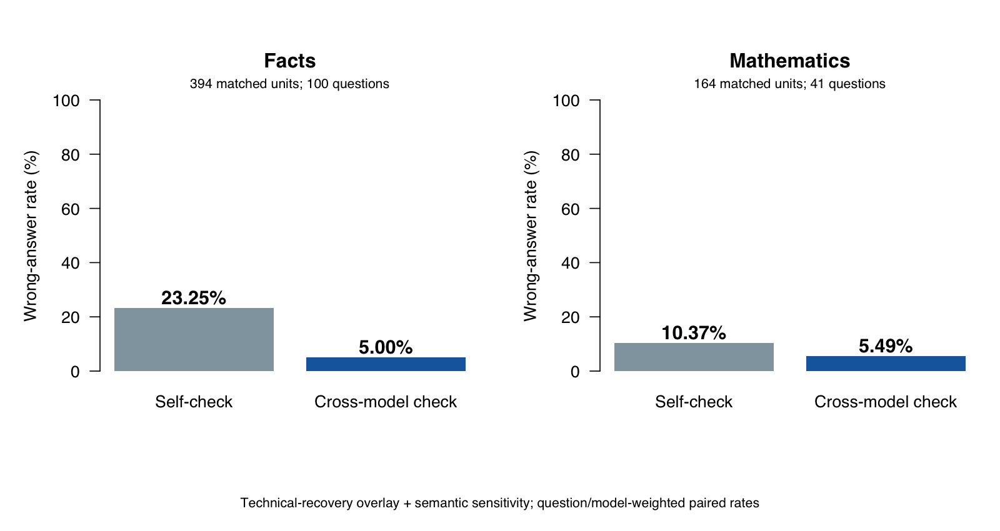

# Can We Trust AI More After Cross-Checking?

**LINYUNIAN · PAN ZHENGYU**

This summary separates the unchanged original experiment from the technical-recovery appendix. The table below uses the recovery overlay and explicitly documented semantic scoring sensitivity. It is not a retroactive replacement of the frozen primary analysis.

## Natural cross-checking versus self-checking

| Domain | Self-check error | Cross-model error | Difference (pp) | 97.5% interval (pp) | Matched units / questions |
|---|---:|---:|---:|---|---:|
| Facts | 23.25% | 5.00% | -18.25 | [-22.00, -14.25] | 394 / 100 |
| Mathematics | 10.37% | 5.49% | -4.88 | [-9.15, -1.22] | 164 / 41 |

A negative difference means fewer wrong answers under cross-checking. Correct answers and explicit abstentions are both non-errors. Technical failures and unresolved outputs remain separate. Repetitions are averaged within question/model, questions within model, and then the two model means receive equal weight. A matched unit is one question × receiving model × repetition; it is not a new independent question.

**The mathematical recovery includes a higher output-token limit in 21 selected recovery responses, including 19 originally truncated tasks. These completed-data estimates are supplementary; they do not retrospectively make the original protocol’s primary comparison conclusive.** The unchanged original semantic mathematics result was −4.33 pp with a 97.5% interval crossing zero. The appendix separately checks source exposure and changed-token-limit questions.

## Receiving models

| Domain | Receiving model | Advice from | Self-check error | Cross-model error |
|---|---|---|---:|---:|
| Facts | DeepSeek | MiniMax | 2.00% | 2.00% |
| Facts | MiniMax | DeepSeek | 44.50% | 8.00% |
| Mathematics | DeepSeek | MiniMax | 2.44% | 3.66% |
| Mathematics | MiniMax | DeepSeek | 18.29% | 7.32% |

## Completion and remaining exclusions

All scheduled tasks have been processed and all technical-recovery targets have reached an outcome. Across both stages, 2,418 request attempts are retained. The derived dataset contains 2,323 final task records: 1,591 facts and 732 mathematics. Nine factual branches remain uncollected because three original initial answers violate the input schema; they were not retried based on their content. Six final records remain semantically unscorable (one factual date-precision case and five mathematical incomplete-format cases). Thus 2,317 final responses are semantically scorable. These are response counts across conditions, not independent questions or a pooled accuracy estimate.

Original records were preserved; the overlay uses the final permitted technical attempt and adds previously blocked branches only after their actual inputs become usable. Original and recovery request hashes and task coverage were independently checked. The [cost ledger](collection_cost_ledger.csv) separates usage-based conservative estimates from reserves for unknown charges; neither is a supplier invoice.

## Interpretation and limits

The models independently answered before the receiver saw the other model’s actual answer. Self-check and cross-check start from the same receiver initial response. Search is available and optional; results evaluate the configured model-plus-tool systems, not unaided knowledge or reasoning. The project uses selected public benchmark questions, so these rates are not universal estimates of everyday AI errors.

The direction and uncertainty must be interpreted separately for each domain and receiving model. A zero observed error rate does not imply zero true risk. Public benchmark answers can appear in search results; source-risk exclusion analyses are reported in the domain reports. Correct final answers also do not prove that every reasoning step is correct.

Two separate mathematical checks retain the direction: excluding all 11 questions ever exposed to the larger token limit gives 5.83% versus 0.00% on 30 questions (difference −5.83 pp, 97.5% interval [−10.00, −1.67]); excluding 17 questions with visible benchmark-source risk gives 11.46% versus 6.25% on 24 questions (difference −5.21 pp, interval [−10.42, −1.04]). These are separate post-hoc subsets, not a combined exclusion or proof of zero risk. The factual source-risk exclusion also retains a reduction.

The misconception and AI-versus-human attribution comparisons are exploratory and are documented separately below. A donor receiving a wrong premise does not necessarily produce a wrong answer. The human label is simulated; no human participants were studied.

The specific full chain — donor neutral answer correct, donor misconception answer wrong, receiver initially correct, receiver finally wrong — was not observed in the mechanism subsets. There were six eligible factual opportunities and one eligible mathematical opportunity, with the same opportunities reused under the AI and human headers. These small denominators do not establish immunity, and the study does not establish that human-attributed advice is generally more harmful than AI-attributed advice.

## A verified counterexample

In the original Polynomial 11 run (repetition 1), DeepSeek initially answered 20 and its self-check also answered 20. MiniMax independently answered 24 using an incorrect period-five argument. After receiving that actual advice, DeepSeek answered 24 in the cross-check branch. An independent R recurrence calculation confirms period six and answer 20. This demonstrates an observed correct-to-wrong cross-check outcome; it is a natural AI-advice example, not evidence from a real human participant or the upstream-misconception condition.

See the [independent mathematical cross-review](../facts/recovery/reports/CROSS_REVIEW_MATH.md). A correct final number and correct reasoning are different evaluation targets; this experiment’s headline error rate measures the final answer.

## Auditable reports

- [Original facts report](../facts/reports/REVIEWED_RESULTS.md)
- [Original mathematics report](../math/reports/REVIEWED_RESULTS.md)
- [Fact recovery appendix](../facts/recovery/reports/RECOVERY_REPORT.md)
- [Mathematics recovery appendix](../math/recovery/RECOVERY_REPORT.md)
- [Original-completion integrity audit](original_completion_audit.json)

All original records, failed attempts and recovery attempts are retained. The recovery scripts retry technical failures only, with at most two recovery attempts per target, and do not retry an answer because it is wrong or abstains. A larger mathematical output limit is used only for genuine max-token truncations and is explicitly a secondary-analysis change. Any unresolved dependency remains visible; “all scheduled tasks processed” does not mean all tasks produced usable answers.
