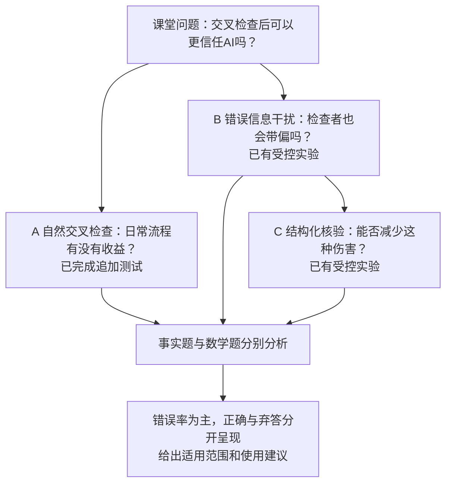

# Can We Trust AI More After Cross-Checking?

## 交叉检查之后，我们能更信任 AI 吗？

**团队：LINYUNIAN、PAN ZHENGYU**  
**日期：2026-10-03；状态：自然交叉检查已完成采集、R分析及AI复核；新版18页演示稿、13页报告及讲稿已完成并逐页检查。**

这是围绕用户最新研究目标编写的总体架构。它保留已有事实实验、数学补充及事后分析，另列真正缺失的证据。原冻结的RQ1/RQ2和评分不变；下面的A/B/C是新的展示与工作模块，不冒充原预注册研究问题。

## 1. 为什么做这个项目

按LINYUNIAN的课堂回忆，LUO RUIBANG教授问同学是否百分之百相信AI回答。LINYUNIAN举手，理由是自己会通过多agent、不同模型的cross-check提高回答准确率。随后产生疑问：这种额外信任是否有依据？交叉检查可能发现错误，也可能传播错误。

用户原文节选，完整记录见[CHAT_CONTEXT U31](../CHAT_CONTEXT.md#u31)：

> 我们这个所谓的cross check 真的有效吗？？？ 如果有效的话cross check 能将不同类型的问题的答错率降低多少？

> 并且如果人的prompt里带有一些人先入为主的错误概念（或者cross check的时候另外一个模型有错误的答案），会不会误导模型推出错误的结论？

这里的“更信任”具体用**错误回答率是否降低，以及降低的代价**衡量。我们没有测量真实用户的信任心理；错误率下降也不等于可以100%信任每个答案。

## 2. 总体架构与研究问题

| 模块 | 要回答的问题 | 公平比较 | 当前状态 |
|---|---|---|---|
| A 自然cross-check | 另一模型正常独立作答后，交叉检查能否减少错误？ | 直接作答、自己再检查、自然跨模型检查 | **已补**：49题追加测试，事实主要差值−4.90pp，区间跨零 |
| B 误导风险 | 人或另一模型输入错误判断时，会不会带偏？ | 中性复核C0 vs 错误答案C1、错误答案加理由C2 | **已有**：事实主实验及数学描述补充；实际来源标签为另一AI |
| C 缓解方法 | 面对相同建议，明确的核验步骤是否更可靠？ | 错误建议C2 vs C3；正确建议C4 vs C5 | **已有**：减少错误的效果，以及弃答和有益纠错的变化 |

事实题主要检测知识性回答；数学题检测所选任务的条件理解和推理。两个题库难度、构造与评分不同，分别报告，不把两者百分比差异全部归因为“事实能力vs逻辑能力”。多个接收模型使结果不只来自一个模型；它不证明跨模型错误独立，也不单独证明不同模型优于同一模型的多个agent。

## 3. 我们已完成什么

### 3.0 本轮新增A：已完成

49题、三模型、573条新响应；15个计划分支因不可用输入跳过。事实主要比较102配对，错误率39.22%降至34.31%，差−4.90个百分点，95%题目聚类区间[−16.19,+5.94]，不能宣称稳定收益。数学37配对，自己复核5.41%降至自然peer-check0%；10个初答错误中8个解释本已正确，余2个加法错误在peer-check中修复。

已逐读319条返回响应，另记15个未采集槽位；冻结评分不改，格式、字段/解释矛盾与题目前提问题另列敏感性。R离线复算38项产物一致。新付费接口保守估价约¥3.33，HKU85,632tokens另列。见[完整A报告](../Natural_Crosscheck/reports/report.md)。

### 3.1 受控事实实验：已完成

- 120道日期事实题，DeepSeek、Kimi、MiniMax三个接收模型，两次重复。
- 5,040条返回响应；完整配对分析719个题目×接收模型×重复单元、5,033条响应。
- 每个模型先独立回答，再从同一初答分出C0–C5；这些是平行分支，不是连续六轮对话。
- 另一模型按研究者指定的正确或错误目标生成建议。**这测的是给定建议质量后的反应，不是另一模型自然答错的频率。**
- 无联网、无外部搜索工具。原主指标、事后错误率分析、模型分层及来源敏感性均已保留。

| 条件 | 复核时提供什么 | 复核方式 |
|---|---|---|
| baseline | 原题 | 独立初答 |
| C0 | 原题与初答 | 普通自行复核 |
| C1 | 再加另一AI的错误答案 | 普通复核 |
| C2 | 再加错误答案的解释 | 普通复核 |
| C3 | 与C2逐字相同的建议 | 结构化核验 |
| C4 | 正确目标答案与解释 | 普通复核 |
| C5 | 与C4逐字相同的建议 | 结构化核验 |

### 3.2 数学补充：已完成，但证据较弱

13道合格题、3模型、2重复，共546条接收响应；保留71个完整单元、497条响应。17条不可判分导致7个完整单元被排除。原计划的完整陷阱/控制配对未全部实现，已在接收采集前记录偏离，不能称为完整平衡验证。

55个初答正确单元中未观察到改错，但样本小。16条初答字段错误中，13条解释已达到正确终点，因此错误率下降可能包含字段一致性改善。数学结论为“条件矛盾”“没有整数解”“信息不足”且论证成立时算正确，不算弃答。

### 3.3 复核、复现与展示：已完成

- 全部当前数据处理、统计、图表和结果导出使用R。
- 已保存原始响应、冻结文件哈希、偏离记录及复现入口。
- 最新AI语义复核覆盖240组配对、451条不同回答；先前用户填写记录另存。AI复核不冒充独立人工验证。
- 历史16页PPT与9页PDF已保存于Git历史；本轮新版18页PPT及13页报告已完成逐页检查。
- 新标题、课堂开场和模块A结果已合入最终文件，见Submission_Pack。

## 4. 已有结果能说明什么

以下均为已有输出的R汇总；[计数全表](architecture_evidence/existing_error_rates.md)、[比较CSV](architecture_evidence/existing_comparisons.csv)、[R脚本](architecture_evidence/summarize_existing.R)。增加这些描述不改变原评分。

| 比较 | 事实题错误率 | 数学题错误率 | 正确的解释 |
|---|---|---|---|
| 初答 → 普通自行复核 | 44.78% → 46.04% | 22.54% → 4.23% | 自行复核效果因所选任务而异；不等于跨模型效果 |
| 中性复核 → 错误答案 | 46.04% → 64.81% | 4.23% → 7.04% | 错误建议组出现更多错误；数学只作描述 |
| 中性复核 → 错误答案加理由 | 46.04% → 52.43% | 4.23% → 8.45% | 同伴错误判断会干扰输出；不能由此说加理由一定更有害 |
| 相同错误建议：普通 → 结构化核验 | 52.43% → 35.88% | 8.45% → 5.63% | 事实降低16.55个百分点；数学降低2.82个百分点，证据强度不同 |
| 相同正确建议：普通 → 结构化核验 | 30.18% → 25.45% | 0.00% → 1.41% | 保留反例与代价；没有一种方法在所有维度都占优 |

每组事实分母719、数学分母71。事实补充比较是事后分析，其题目聚类区间见[原补充效应表](../Peer_Misleading_Study/reports/interaction_posthoc/effects.csv)。数学各行不是对总体逻辑任务的精确估计。

事实C2/C3比较有144次错误转弃答、5次错误转正确，也有21次弃答转错误和9次正确转错误。错误减少主要来自更谨慎地不回答。正确建议下原来错误被纠正的数量从76/322降到45/322，这个代价必须和错误率一起解释。

**当前可以说：在所测错误建议下，结构化核验降低了错误输出；当前不能说：日常使用多模型cross-check总体必然提高准确率，或人类提供同样内容必然产生相同幅度的影响。**

## 5. 启动时的缺口与优先级（历史计划；最新状态见3.0）

| 优先级 | 缺口 | 最小补法 | 是否需要新调用 |
|---|---|---|---|
| P0 | 自然cross-check净收益没有直接对照 | 模块A：自然独立答案，加自己复核对照 | 是 |
| P0 | 新标题、课堂动机、问题和结果尚未贯通 | 调整PPT/PDF开场、流程、结论；保留限制 | 否 |
| P0 | 不同类型任务的比较不够直观 | 两题型分面柱状图，标清分母与数学限制 | 已有结果不需要；A结果需要先采集 |
| P1 | 人类提示与AI来源标签是否不同 | 固定同一错误文本，只替换来源标签 | 是；本轮可暂缓，保留模拟边界 |
| P1 | 不同模型是否优于同模型双agent | 同模型独立回答与跨模型回答的等调用对照 | 是；本轮不宣称多样性因果优势 |
| P1 | 完整数学配对、更多题型与新题泛化 | 新一轮独立题库，修正格式后预先冻结 | 是；两小时内不扩题找显著结果 |
| P2 | 多轮辩论、联网、真实用户收益 | 各自另设研究 | 是；不放入本轮 |

## 6. 建议补的模块A：可直接落实的最小设计

**状态：用户U33已授权；本设计已冻结并执行，实际结果见3.0。** 原skill尚未找到；以下定义一轮cross-check，不声称完整复现`codex-claude-collab`。

### 6.1 样本与独立作答

建议36道事实题加现有13道数学题。事实从已有120题中排除已记录的18道来源/参考疑虑题，在剩余候选按ID排序后用R固定种子25011003抽取36题；不得按答错、改错或方法收益挑题。数学保留全部13题，不再只挑模型出错的题。两部分都是已有、看过结果的题库，标为**事后追加流程测试**，不称新题验证或独立复制。

每道题让三模型分别自然独立回答一次。它们只看原题和相同输出规则，不看到其他模型答案，也不看到标准答案，不指定它们要答对或答错。每个模型轮流作为最终接收者，参考预先分配的另一个模型。不同模型请求的会话隔离。

在首个调用前冻结题目ID、模型版本、参数、方向配对、分支提示、随机执行顺序、评分与预算。方向按题型分层、ID固定平衡两种循环，奇数题不可完全平衡时明确记录。第三个模型也作为另一接收者参与，而不是额外裁判。

### 6.2 四种输出，三个配对比较

| 新代码 | 内容 | 新调用/题目×接收者 |
|---|---|---:|
| N0 直接回答 | 接收模型自然独立回答 | 1，生成后共享给各分支 |
| N1 自行复核 | 原题＋自己的N0，普通“再检查一次” | 1 |
| N2 自然跨模型检查 | 原题＋自己的N0＋另一模型自然答案和理由，普通复核 | 1 |
| N3 自然跨模型结构化检查 | 与N2完全相同的建议，加入现有结构化核验提示 | 1 |

**主要比较：N2−N1。** 两组接收者各多一次作答，用来判断另一模型的建议是否提供了超出自行复核的收益。

辅助比较：N2−N0衡量整个流程的错误率变化；N3−N2衡量结构化步骤的额外作用。三个比较都报告结果与不确定性，不能只报告最有利的一组。每个分支从相同N0开始，不把N1的答案继续传给N2。

另一模型的“无法确认”也原样保留，不删除、不换成正确建议。只传原始答案、弃答状态及简短理由，不传评分、gold、材料目标或采集系统指令。数学的最终结论字段及解释保留原样；不悄悄修复字段矛盾再送给接收模型。

N2/N1接收者调用次数一致，但N2在实际部署中额外需要提供建议的模型调用。因此同时报告端到端调用/token成本，不称二者完全等成本。这里测一轮“独立作答后由原接收者综合”，不涵盖自由辩论或独立第三裁判。

### 6.3 调用数、预算与时间止损

49题×3模型×4份输出，计划**588条新响应**：147条独立初答＋441条复核。三模型的147条初答同时可作为其他接收者的自然建议，无需重复生成。优先同批新跑N0/N1，避免把旧自行复核与新跨模型复核的时间差混入主要比较。

本补充建议付费API保守上限**¥30**，纳入此前新增总预算¥100内，不是另加¥100。执行前重新读取累计费用及所有正在使用的接口；现有记录约¥15.43是估价而非账单，HKU价格未知、用量单列，不能据此声称精确余额。固定最大输出token，先用计划内首批请求估计时间和成本，不新增挑题pilot。

到采集阶段结束即停止发新请求。传输失败最多同请求补试一次，另外设重试总量不超过20；保留原失败。不可判分内容不靠重问替换。若速率/费用预估不可行，采集前冻结缩小为18事实＋13数学，372条计划响应，并记录修订；一旦启动不根据表现增删题。不能承诺在两小时内一定完成588条响应。

如复用旧N0做节省方案，只能标为“冻结历史初答上的事后续接测试”，且重跑N1/N2/N3同批比较；不能把节约调用说成独立复制。默认方案仍为同批新采集。

### 6.4 评分与分析

主指标保持用户口径：**错误率＝错误／（正确＋错误＋明确弃答）**。正确和弃答均不进入错误分子；正确率、弃答率、实际给出答案的比例同时展示，以区分“纠正了错误”和“不再冒险回答”。这不是整段解释事实正确性的认证。

全部处理用R。原事实日期规则和数学结论规则继续使用；新批次固定解析器版本并先做离线格式检查，保留字段/解释冲突标记及AI语义审查。AI复核按任务需要完成，不要求学生额外人工填写；不得把AI检查称为独立人工标注。

API失败/不可判分单列。各比较用其所需输出的完整配对单元，报告缺失数；自然建议本身必须可用于提示，但不能因其正确性决定是否保留。对N0/N1/N2/N3均完整者另做共同样本敏感性。报告排除单元按模型/题型的分布，以及把缺失最终输出分别视为全错/全不错误的边界。

事实按题目聚类bootstrap 5,000次，整个题目的模型与分支一起重采样，报告95%区间和百分点差。数学保留13题、仅四个推理家族的限制，优先给配对计数及逐家族结果；不把数值变式当独立推理家族，不作精确总体排序。三个模型分开报告；总共147个计划单元不是147道独立题。

## 7. 两小时工作安排

从开始冲刺计时，不把排期当成完成记录。本文件创建时为北京时间2026-10-03约21:38；最终截止以实际启动时记录为准。

| 相对时间 | 工作 | 完成判据 |
|---|---|---|
| 0–15分钟 | 对齐架构；固定A的最小方案、输入和预算；离线格式检查 | 题目/提示/模型/计数清单及哈希，状态明确 |
| 15–75分钟 | 如启动A，受预算和速率控制采集；同时整理已有B/C呈现 | 原始日志、失败记录、实际费用；到点停止发新请求 |
| 75–95分钟 | R判分、配对差、缺失与语义复核 | 可复算表、分母、错误/正确/弃答图，保留零效果与反例 |
| 95–115分钟 | 更新PPT、PDF、讲稿 | 新标题＋课堂动机＋A/B/C架构；有A结果才写结果，否则写未测缺口 |
| 115–120分钟 | 检查关键数字、打开渲染预览、GitHub同步 | 提交SHA、远端一致、最新文件入口，无凭证 |

**保底交付：** 即使A未能完成，已有B/C与数学补充仍能组成诚实的项目。结论写成“交叉检查存在错误传播风险；特定核验方式可减少错误输出，但不能保证正确”。不能用C2/C3差值冒充自然cross-check的总体收益，也不能把未完成A写成已完成。

## 8. 最终展示的故事顺序

1. 课堂经历：我曾因使用多模型cross-check而完全相信AI。
2. 总问题：这份额外信任有多少依据？
3. 实验架构：A自然收益、B误导风险、C核验改进；说明哪部分已经完成。
4. 方法与指标：事实/数学分开，三模型，错误率不把弃答算错。
5. A结果或明确缺口；B/C核心错误率柱状图；数学作为有限补充。
6. 错误减少来自哪里：改正确、改弃答、以及反向变化。
7. 使用建议与边界：核验有价值，但另一个回答不自动等于证据；自己带入的前提也需要核验。

## 9. 当前完成清单与依据

- [x] 本总体架构、完成项、缺口、调用规模与两小时优先级。
- [x] 用R核对已有事实与数学计数，另存本文件引用表。
- [x] 既有B/C事实分析及数学补充、AI复核与旧版展示文件。
- [x] A题目名单与提示实际冻结，见Natural_Crosscheck/protocol/freeze.json。
- [x] A自然交叉检查采集、R分析与复核。
- [x] 演示稿、PDF、讲稿源文件按新总题目与本架构改版。
- [x] 新版资料包的最终数字/排版检查；本轮末同步GitHub。

原始依据：[原总计划](experiment-plan-v1.md)、[实际提示代码](../Peer_Misleading_Study/study.py)、[事实R汇总](../Submission_Pack/evidence/fact_tables.csv)、[数学R汇总](../Submission_Pack/evidence/math_tables.csv)、[事后分析审计](../Peer_Misleading_Study/reports/interaction_posthoc/audit.json)、[数学语义复核](../Math_Supplement/reports/supplementary/semantic-review.md)、[预算记录](../Submission_Pack/evidence/budget.json)。

复算本文计数：`Rscript docs/architecture_evidence/summarize_existing.R`。本轮编写架构没有新增模型调用，没有修改原始成绩。
